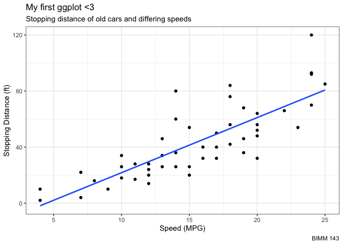
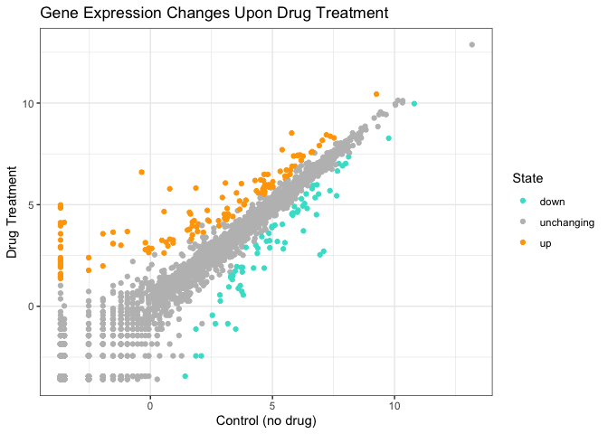
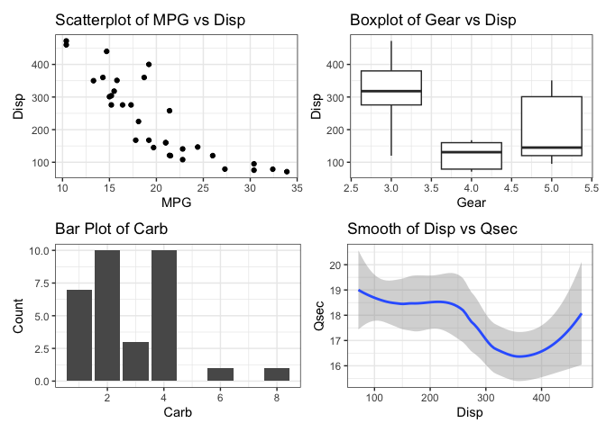
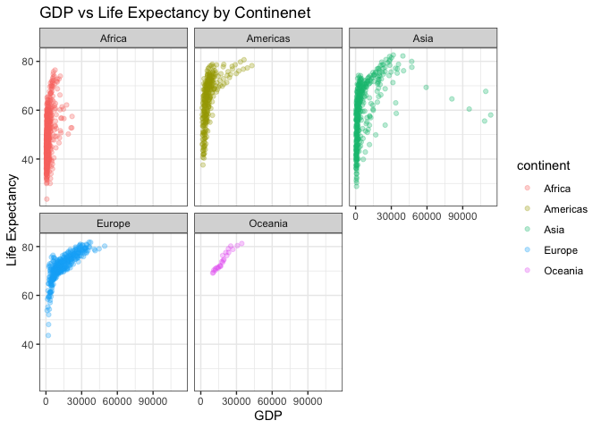

# Class 5: Data Viz with ggplot
Zoe Matsunaga (PID: A16853288)

- [Background](#background)
- [Using different aes and geoms](#using-different-aes-and-geoms)
- [Gene expression plot](#gene-expression-plot)
- [Using different geoms](#using-different-geoms)
  - [Faceting](#faceting)

# Background

There are many graphics systems available in R. These include “base” R
and many add on packages, such as **ggplot2**.

Let’s compare “base” R and **ggplot2** briefly. We can use some example
data that is built-in with R called `cars`:

``` r
head(cars)
```

      speed dist
    1     4    2
    2     4   10
    3     7    4
    4     7   22
    5     8   16
    6     9   10

In “base” R, I can just call `plot()`

``` r
plot(cars)
```


How can we do this with **ggplot2**?

First we need to install the package. We do this with
`install.packages("ggplot2")`. I only need to do this once and then it
will be available on my computer from then on.

> Key point: I only install packages in the R console, not within Quarto
> docs or R scripts.

Beefore I use any add-on package, I must load it up with a call to
`library()`.

``` r
library(ggplot2)
ggplot(cars)
```


Every ggplot has/needs at least 3 things:

- the **data** (in our case `cars`)
- the **aes**thetics (how the data map to the plot)
- the **geom**s that determine how the plot is drawn (lines, points,
  columns, etc.)

``` r
ggplot(cars) +
  aes(x=speed, y=dist) +
  geom_point()
```


For “simple” plots, ggplot is much more verbous than “base” R, but the
defaults are nicer. For complicated plots, it becomes much more
efficient and structured.

Q. Add a line to show the relationship of speed to stopping distance
(i.e. add another “layer”)

# Using different aes and geoms

``` r
ggplot(cars) +
  aes(x=speed, y=dist) +
  geom_point() +
  geom_line()
```


``` r
p <- ggplot(cars) +
  aes(x=speed, y=dist) +
  geom_point() +
  geom_smooth (se=FALSE, method="lm")
```

I can always save any ggplot object (i.e. plot) and then use it later
for adding more layers.

``` r
p
```

    `geom_smooth()` using formula = 'y ~ x'


> Q. Add some title and subtitle to the plot

``` r
p + labs(title = "My first ggplot <3",
         subtitle = "Stopping distance of old cars and differing speeds", 
         caption = "BIMM 143",
         x= "Speed (MPG)",
         y= "Stopping Distance (ft)") +
theme_bw()
```

    `geom_smooth()` using formula = 'y ~ x'



# Gene expression plot

Read input data into R

``` r
url <- "https://bioboot.github.io/bimm143_S20/class-material/up_down_expression.txt"
genes <- read.delim(url)
head(genes)
```

            Gene Condition1 Condition2      State
    1      A4GNT -3.6808610 -3.4401355 unchanging
    2       AAAS  4.5479580  4.3864126 unchanging
    3      AASDH  3.7190695  3.4787276 unchanging
    4       AATF  5.0784720  5.0151916 unchanging
    5       AATK  0.4711421  0.5598642 unchanging
    6 AB015752.4 -3.6808610 -3.5921390 unchanging

> Q. How many genes are in this dataset?

``` r
nrow(genes)
```

    [1] 5196

> Q. How many columns are there?

``` r
ncol(genes)
```

    [1] 4

> Q. What are the column names?

``` r
colnames(genes)
```

    [1] "Gene"       "Condition1" "Condition2" "State"     

> Q. How many “up” and “down” regualted genes are there?

``` r
table(genes$State)
```


          down unchanging         up 
            72       4997        127 

> Q. Make a first plot of this data.

``` r
ggplot(genes) + 
  aes(x=Condition1, y=Condition2, col=State) +
  scale_color_manual(values=c("turquoise", "grey", "orange")) +
  geom_point()+
  labs(title = "Gene Expression Changes Upon Drug Treatment",
       x="Control (no drug)",
       y="Drug Treatment")+
  theme_bw()
```



# Using different geoms

Let’s plot some aspects of the in-built `mtcars` dataset.

``` r
head(mtcars)
```

                       mpg cyl disp  hp drat    wt  qsec vs am gear carb
    Mazda RX4         21.0   6  160 110 3.90 2.620 16.46  0  1    4    4
    Mazda RX4 Wag     21.0   6  160 110 3.90 2.875 17.02  0  1    4    4
    Datsun 710        22.8   4  108  93 3.85 2.320 18.61  1  1    4    1
    Hornet 4 Drive    21.4   6  258 110 3.08 3.215 19.44  1  0    3    1
    Hornet Sportabout 18.7   8  360 175 3.15 3.440 17.02  0  0    3    2
    Valiant           18.1   6  225 105 2.76 3.460 20.22  1  0    3    1

> Q. Scatter plot of `mpg` vs `disp`

``` r
p1 <- ggplot(mtcars)+
        aes(x=mpg, y=disp)+
        geom_point()+
        labs(title="Scatterplot of MPG vs Disp",
              x="MPG",
              y="Disp")+
      theme_bw()
```

> Q. Boxplot of `gear` vs `disp`

``` r
p2 <- ggplot(mtcars) +
      aes(gear, disp, group=gear) +
      geom_boxplot() +
      labs(title="Boxplot of Gear vs Disp",
            x="Gear",
           y="Disp")+
      theme_bw()
```

> Q. Bar plot of `carb`

``` r
p3 <- ggplot(mtcars)+
       aes(carb)+
       geom_bar()+
       labs(title = "Bar Plot of Carb", 
            x= "Carb",
            y= "Count")+
      theme_bw()
```

> Q. Smooth of `disp` vs `qsec`

``` r
p4 <- ggplot(mtcars) + 
      aes(disp, qsec) +
      geom_smooth() +
      labs(title= "Smooth of Disp vs Qsec",
           x="Disp",
           y="Qsec") + 
      theme_bw()
```

I want to combine all these plots into one figure with multiple pannels.

We can use the **patchwork** package to do this.

``` r
library(patchwork)

(( p1 | p2) / (p3 | p4 ))
```

    `geom_smooth()` using method = 'loess' and formula = 'y ~ x'



``` r
ggsave(filename="myplot.png", width=5, height=3)
```

    `geom_smooth()` using method = 'loess' and formula = 'y ~ x'

## Faceting

``` r
url <- "https://raw.githubusercontent.com/jennybc/gapminder/master/inst/extdata/gapminder.tsv"

gapminder <- read.delim(url)
```

A little peek

``` r
head(gapminder)
```

          country continent year lifeExp      pop gdpPercap
    1 Afghanistan      Asia 1952  28.801  8425333  779.4453
    2 Afghanistan      Asia 1957  30.332  9240934  820.8530
    3 Afghanistan      Asia 1962  31.997 10267083  853.1007
    4 Afghanistan      Asia 1967  34.020 11537966  836.1971
    5 Afghanistan      Asia 1972  36.088 13079460  739.9811
    6 Afghanistan      Asia 1977  38.438 14880372  786.1134

> Q. How many countries are in this dataset?

``` r
length(table(gapminder$country))
```

    [1] 142

> Q. Plot GDP vs Life Expectancy, Colored by Continent

``` r
ggplot(gapminder) +
  aes(gdpPercap, lifeExp, col=continent) +
  geom_point(alpha=0.3) +
  facet_wrap(~continent) +
  labs(title= "GDP vs Life Expectancy by Continenet",
       x="GDP", 
       y="Life Expectancy") +
  theme_bw()
```


