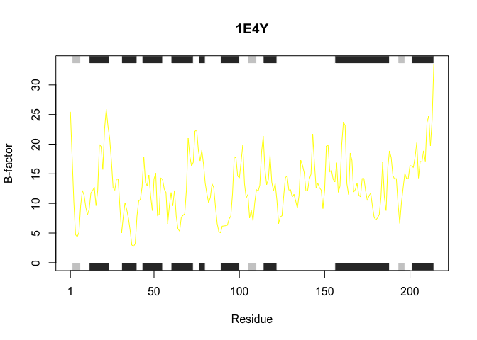

# HW6 Q6
Zoe Matsunaga (PID: A16853288)

> Q.Can you improve this analysis code?

``` r
library(bio3d)
s1 <- read.pdb("4AKE") # kinase with drug
s2 <- read.pdb("1AKE") # kinase no drug
s3 <- read.pdb("1E4Y") # kinase with drug
s1.chainA <- trim.pdb(s1, chain="A", elety="CA")
s2.chainA <- trim.pdb(s2, chain="A", elety="CA")
s3.chainA <- trim.pdb(s1, chain="A", elety="CA")
s1.b <- s1.chainA$atom$b
s2.b <- s2.chainA$atom$b
s3.b <- s3.chainA$atom$b
plotb3(s1.b, sse=s1.chainA, typ="l", ylab="Bfactor")
plotb3(s2.b, sse=s2.chainA, typ="l", ylab="Bfactor")
plotb3(s3.b, sse=s3.chainA, typ="l", ylab="Bfactor")
```

> Optimized Code without Comments (not run):

``` r
library(bio3d) 
drug_pdb <- function(pdb_id, chain="A", elety="CA"){   
  pdb <- read.pdb (pdb_id) 
  chain_trimmed <- trim.pdb(pdb, chain=chain, elety=elety) 
  b_factor <- chain_trimmed$atom$b 
  return(list(b=b_factor, sse=chain_trimmed, id=pdb_id))  
}

pdb_id <- c("4AKE","1AKE","1E4Y") 
pdb_data <- lapply(pdb_id, drug_pdb) 

plot_data <- function(pdb_data, colors) {
  for (x in seq_along(pdb_data)) {
    plotb3(pdb_data[[x]]$b, sse=pdb_data[[x]]$sse, typ="l",
           col=colors[x], main=pdb_data[[x]]$id, ylab="B-factor")
  }
} 

my_colors <- c("green", "pink", "yellow") 
plot_data(pdb_data, my_colors) 
```

This code is more optimized and allows the user to insert any set of
input structures given the pdb id. Also because majority of the code is
a function or has a assigned property, the assigned variable can be
typed out. However, `pdb_id` needs to change when the structure changes.

> Optimized Code with Comments:

``` r
library(bio3d) #retrieve bio3d
drug_pdb <- function(pdb_id, chain="A", elety="CA"){  #function with the input arguments 
  pdb <- read.pdb(pdb_id) # read the pdb 
  chain_trimmed <- trim.pdb(pdb, chain=chain, elety=elety) #original code condensed
  b_factor <- chain_trimmed$atom$b #original code condensed 
  return(list(b=b_factor, sse=chain_trimmed, id=pdb_id)) #added for readability
}

pdb_id <- c("4AKE","1AKE","1E4Y") #can be edited without editing the function
pdb_data <- lapply(pdb_id, drug_pdb) #connecting the `pdb_id` to the `read.pdb`
```

      Note: Accessing on-line PDB file
      Note: Accessing on-line PDB file
       PDB has ALT records, taking A only, rm.alt=TRUE
      Note: Accessing on-line PDB file

``` r
plot_data <- function(pdb_data, colors) {
  for (x in seq_along(pdb_data)) {
    plotb3(pdb_data[[x]]$b, sse=pdb_data[[x]]$sse, typ="l",
           col=colors[x], main=pdb_data[[x]]$id, ylab="B-factor")
  }
} #using a function to plot the data as separate graphs

my_colors <- c("green", "pink", "yellow") #choice of colors
plot_data(pdb_data, my_colors) #plot!
```



