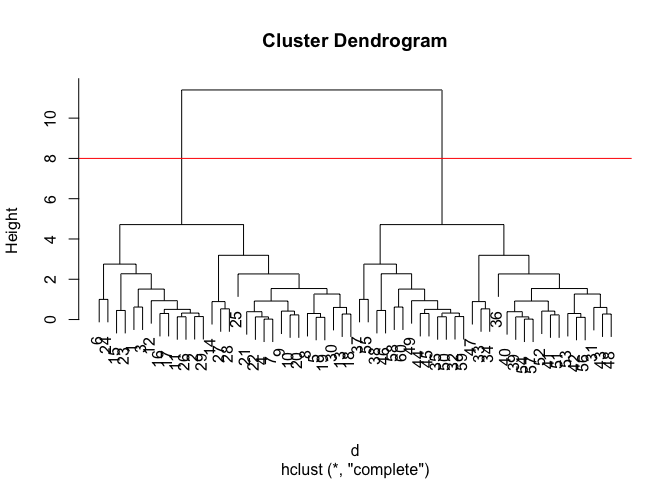

# Class 7: Machine Learning 1
Zoe Matsunaga (PID: A16853288)

- [Clustering](#clustering)
  - [K-means](#k-means)
  - [Hierarchical CLustering](#hierarchical-clustering)
- [Principal Component Analysis
  (PCA)](#principal-component-analysis-pca)
  - [Data Import](#data-import)
  - [PCA to the rescue](#pca-to-the-rescue)
  - [Interpreting PCA Results](#interpreting-pca-results)

Today we will explore unsupervised machine learning methods starting
with clustering and dimensionsality reduction.

## Clustering

To start, let’s make up some data using the `rnorm()` function to
cluster where we know what the answer should be.

``` r
hist(rnorm(10000, mean = 3))
```


Return 30 numbers centered on -3 and +3

``` r
tmp <- c(rnorm(30, mean=-3),
       rnorm(30, mean =3))

x <- cbind(x=tmp, y=rev(tmp))

x
```

                   x          y
     [1,] -1.6519533  3.7790606
     [2,] -2.7700255  2.8957325
     [3,] -2.2408518  3.5832084
     [4,] -3.2669834  2.8677356
     [5,] -3.8152406  1.7885412
     [6,] -0.1454996  3.1257745
     [7,] -3.2831608  2.8816512
     [8,] -3.9631301  1.5283500
     [9,] -4.1127879  2.5110002
    [10,] -3.8691176  2.5078219
    [11,] -2.7605316  3.1646882
    [12,] -2.3232455  2.4238799
    [13,] -3.1603678  1.8677465
    [14,] -3.0336749  3.8514391
    [15,] -2.2382371  1.5835623
    [16,] -2.4833185  3.2008963
    [17,] -2.4655078  2.9009547
    [18,] -3.2640052  1.6137027
    [19,] -3.9210514  1.8136149
    [20,] -3.7429108  2.3148508
    [21,] -3.5616284  3.0142185
    [22,] -3.2762082  2.7498710
    [23,] -1.7885458  1.6025794
    [24,] -0.8451208  3.8411391
    [25,] -4.8511970  2.8502944
    [26,] -2.8972479  3.1615155
    [27,] -3.6637345  4.2093118
    [28,] -3.3936963  4.6664060
    [29,] -2.6414921  2.9675428
    [30,] -2.7707539  1.9562655
    [31,]  1.9562655 -2.7707539
    [32,]  2.9675428 -2.6414921
    [33,]  4.6664060 -3.3936963
    [34,]  4.2093118 -3.6637345
    [35,]  3.1615155 -2.8972479
    [36,]  2.8502944 -4.8511970
    [37,]  3.8411391 -0.8451208
    [38,]  1.6025794 -1.7885458
    [39,]  2.7498710 -3.2762082
    [40,]  3.0142185 -3.5616284
    [41,]  2.3148508 -3.7429108
    [42,]  1.8136149 -3.9210514
    [43,]  1.6137027 -3.2640052
    [44,]  2.9009547 -2.4655078
    [45,]  3.2008963 -2.4833185
    [46,]  1.5835623 -2.2382371
    [47,]  3.8514391 -3.0336749
    [48,]  1.8677465 -3.1603678
    [49,]  2.4238799 -2.3232455
    [50,]  3.1646882 -2.7605316
    [51,]  2.5078219 -3.8691176
    [52,]  2.5110002 -4.1127879
    [53,]  1.5283500 -3.9631301
    [54,]  2.8816512 -3.2831608
    [55,]  3.1257745 -0.1454996
    [56,]  1.7885412 -3.8152406
    [57,]  2.8677356 -3.2669834
    [58,]  3.5832084 -2.2408518
    [59,]  2.8957325 -2.7700255
    [60,]  3.7790606 -1.6519533

Make a plot of `x`

``` r
plot(x)
```


### K-means

The main function in “base” R for K-means clustering is `kmeans()`:

``` r
km <- kmeans(x, centers = 2)
km
```

    K-means clustering with 2 clusters of sizes 30, 30

    Cluster means:
              x         y
    1 -2.940041  2.774112
    2  2.774112 -2.940041

    Clustering vector:
     [1] 1 1 1 1 1 1 1 1 1 1 1 1 1 1 1 1 1 1 1 1 1 1 1 1 1 1 1 1 1 1 2 2 2 2 2 2 2 2
    [39] 2 2 2 2 2 2 2 2 2 2 2 2 2 2 2 2 2 2 2 2 2 2

    Within cluster sum of squares by cluster:
    [1] 47.99792 47.99792
     (between_SS / total_SS =  91.1 %)

    Available components:

    [1] "cluster"      "centers"      "totss"        "withinss"     "tot.withinss"
    [6] "betweenss"    "size"         "iter"         "ifault"      

The `kmeans()` function return a “list” with 9 components. You can see
the named components of any loist with the `attributes()` function.

``` r
attributes(km)
```

    $names
    [1] "cluster"      "centers"      "totss"        "withinss"     "tot.withinss"
    [6] "betweenss"    "size"         "iter"         "ifault"      

    $class
    [1] "kmeans"

> Q. How many points are in each cluster?

``` r
km$size
```

    [1] 30 30

> Q. Cluster assignment/membership vector?

``` r
km$cluster
```

     [1] 1 1 1 1 1 1 1 1 1 1 1 1 1 1 1 1 1 1 1 1 1 1 1 1 1 1 1 1 1 1 2 2 2 2 2 2 2 2
    [39] 2 2 2 2 2 2 2 2 2 2 2 2 2 2 2 2 2 2 2 2 2 2

> Q. Cluster centers?

``` r
km$centers
```

              x         y
    1 -2.940041  2.774112
    2  2.774112 -2.940041

> Q. Make a plot of our `kmeans()` results showing cluster assingment
> using different colors for each group/cluster of points and cluster
> centers.

``` r
plot(x, col=km$cluster)
points(km$centers, col="blue", pch=15, cex=2)
```


> Q. Run `kmeans()` again on `x` and this cluster into 4 groups/clusters
> and plot the same result figure as above.

``` r
km4 <- kmeans(x, centers=4)

plot(x, col=km4$cluster)
points(km4$centers, col="blue", pch=15, cex=2)
```


> **Key-point**: K-means clustering is super popular, but can be
> misused. One big limitation is that it can impose a clustering pattern
> on your data even if clear, natural grouping doesn’t exist - i.e. it
> does what you tell it to do in terms of `centers`.

### Hierarchical CLustering

The main function in “base” R for hierarchical clustering is called
`hclust()`.

You can’t just pass our dataset as is into `hclust()`. You must give a
“distance matrix” as input. We can get this form the `dist()` function
in R.

``` r
d <- dist(x)
hc <- hclust(d)
hc
```


    Call:
    hclust(d = d)

    Cluster method   : complete 
    Distance         : euclidean 
    Number of objects: 60 

The results of`hclust()` don’t have a useful `print()` method, but do
have a special `plot()` method.

``` r
plot(hc)
abline(h=8, col="red")
```



To get our main cluster assignment (membership vector) we need to “cut”
the tree at the big goal posts…

``` r
grps <- cutree(hc, h=8)
grps
```

     [1] 1 1 1 1 1 1 1 1 1 1 1 1 1 1 1 1 1 1 1 1 1 1 1 1 1 1 1 1 1 1 2 2 2 2 2 2 2 2
    [39] 2 2 2 2 2 2 2 2 2 2 2 2 2 2 2 2 2 2 2 2 2 2

``` r
table(grps)
```

    grps
     1  2 
    30 30 

``` r
plot(x, col=grps)
```


Hierarchical clustering is distinct in that the dendogram (tree figure)
can reveal the potential group in your data, unlike K-means.

## Principal Component Analysis (PCA)

PCA is a common and useful dimensionality reduction technique used in
many fields - particularly bioinformatics.

Here we will analyze some data from the UK on food consumption.

### Data Import

``` r
url <- "https://tinyurl.com/UK-foods"
x <- read.csv(url)

head (x)
```

                   X England Wales Scotland N.Ireland
    1         Cheese     105   103      103        66
    2  Carcass_meat      245   227      242       267
    3    Other_meat      685   803      750       586
    4           Fish     147   160      122        93
    5 Fats_and_oils      193   235      184       209
    6         Sugars     156   175      147       139

``` r
rownames(x) <- x[,1]
x <- x[,-1]
head(x)
```

                   England Wales Scotland N.Ireland
    Cheese             105   103      103        66
    Carcass_meat       245   227      242       267
    Other_meat         685   803      750       586
    Fish               147   160      122        93
    Fats_and_oils      193   235      184       209
    Sugars             156   175      147       139

``` r
#destructive!
```

``` r
x <- read.csv(url, row.names=1)
head(x)
```

                   England Wales Scotland N.Ireland
    Cheese             105   103      103        66
    Carcass_meat       245   227      242       267
    Other_meat         685   803      750       586
    Fish               147   160      122        93
    Fats_and_oils      193   235      184       209
    Sugars             156   175      147       139

``` r
barplot(as.matrix(x), beside=F, col=rainbow(nrow(x)))
```


One conventional plot that can be useful is called a “pairs” plot.

``` r
pairs(x, col=rainbow(nrow(x)), pch=16)
```


### PCA to the rescue

The main function in “base” R for PCA is `prcomp()`.

``` r
pca <- prcomp( t(x) )
summary(pca)
```

    Importance of components:
                                PC1      PC2      PC3       PC4
    Standard deviation     324.1502 212.7478 73.87622 2.921e-14
    Proportion of Variance   0.6744   0.2905  0.03503 0.000e+00
    Cumulative Proportion    0.6744   0.9650  1.00000 1.000e+00

The `prcomp()` function returns a list object of our results with five
attributes/components.

``` r
attributes(pca)
```

    $names
    [1] "sdev"     "rotation" "center"   "scale"    "x"       

    $class
    [1] "prcomp"

The two main “results” in here are `pca$x` and `pca$rotation`. The first
of these (`pca$x`) contains the scores of the data on the new PC axis -
we use these to make our “PCA plot”.

``` r
pca$x
```

                     PC1         PC2        PC3           PC4
    England   -144.99315   -2.532999 105.768945 -9.152022e-15
    Wales     -240.52915 -224.646925 -56.475555  5.560040e-13
    Scotland   -91.86934  286.081786 -44.415495 -6.638419e-13
    N.Ireland  477.39164  -58.901862  -4.877895  1.329771e-13

``` r
library(ggplot2)
library(ggrepel)

#Make a plot of pca$x with PC1 vs PC2

ggplot(pca$x) + 
  aes(PC1, PC2, label=rownames(pca$x)) + 
  geom_point() +
  geom_text_repel()
```


The second major result is contained in the `pca$rotation` object or
component. Let’s plot this to see what PCA is picking up…

``` r
ggplot(pca$rotation) +
  aes(PC1, rownames(pca$rotation)) + 
  geom_col()
```


### Interpreting PCA Results

This plot shows that for PC1 there are associations that can be made
between certain food groups and the four European countries. The most
amount of variance can be seen in categories, such as “Fresh_Fruit”
leaning towards England, and “Fresh_Potatoes” favoring Northern Ireland.
