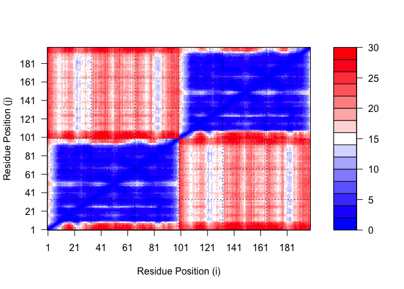

# Class 11: AlphaFold
Zoe Matsunaga (PID: A16853288)

- [Custom Analysis of Resulting
  Models](#custom-analysis-of-resulting-models)
  - [Predicted Alignment Error for
    Domains](#predicted-alignment-error-for-domains)
  - [Residue Conservation from Alignment
    File](#residue-conservation-from-alignment-file)

Here we read the results from AlphaFold and try to interpret all the
models and quality score metrics:

``` r
library(bio3d)

pth <- "dimer_23119"
pdb.files <-list.files(path = pth, full.names=TRUE, pattern=".pdb")
```

Align and superpose all these models

``` r
file.exists(pdb.files)
```

    [1] TRUE TRUE TRUE TRUE TRUE

``` r
pdbs <- pdbaln(pdb.files, fit=TRUE, exefile="msa")
```

    Reading PDB files:
    dimer_23119/dimer_23119_unrelaxed_rank_001_alphafold2_multimer_v3_model_2_seed_000.pdb
    dimer_23119/dimer_23119_unrelaxed_rank_002_alphafold2_multimer_v3_model_5_seed_000.pdb
    dimer_23119/dimer_23119_unrelaxed_rank_003_alphafold2_multimer_v3_model_4_seed_000.pdb
    dimer_23119/dimer_23119_unrelaxed_rank_004_alphafold2_multimer_v3_model_1_seed_000.pdb
    dimer_23119/dimer_23119_unrelaxed_rank_005_alphafold2_multimer_v3_model_3_seed_000.pdb
    .....

    Extracting sequences

    pdb/seq: 1   name: dimer_23119/dimer_23119_unrelaxed_rank_001_alphafold2_multimer_v3_model_2_seed_000.pdb 
    pdb/seq: 2   name: dimer_23119/dimer_23119_unrelaxed_rank_002_alphafold2_multimer_v3_model_5_seed_000.pdb 
    pdb/seq: 3   name: dimer_23119/dimer_23119_unrelaxed_rank_003_alphafold2_multimer_v3_model_4_seed_000.pdb 
    pdb/seq: 4   name: dimer_23119/dimer_23119_unrelaxed_rank_004_alphafold2_multimer_v3_model_1_seed_000.pdb 
    pdb/seq: 5   name: dimer_23119/dimer_23119_unrelaxed_rank_005_alphafold2_multimer_v3_model_3_seed_000.pdb 

``` r
library(bio3d)
pdbs
```

                                   1        .         .         .         .         50 
    [Truncated_Name:1]dimer_2311   PQITLWQRPLVTIKIGGQLKEALLDTGADDTVLEEMSLPGRWKPKMIGGI
    [Truncated_Name:2]dimer_2311   PQITLWQRPLVTIKIGGQLKEALLDTGADDTVLEEMSLPGRWKPKMIGGI
    [Truncated_Name:3]dimer_2311   PQITLWQRPLVTIKIGGQLKEALLDTGADDTVLEEMSLPGRWKPKMIGGI
    [Truncated_Name:4]dimer_2311   PQITLWQRPLVTIKIGGQLKEALLDTGADDTVLEEMSLPGRWKPKMIGGI
    [Truncated_Name:5]dimer_2311   PQITLWQRPLVTIKIGGQLKEALLDTGADDTVLEEMSLPGRWKPKMIGGI
                                   ************************************************** 
                                   1        .         .         .         .         50 

                                  51        .         .         .         .         100 
    [Truncated_Name:1]dimer_2311   GGFIKVRQYDQILIEICGHKAIGTVLVGPTPVNIIGRNLLTQIGCTLNFP
    [Truncated_Name:2]dimer_2311   GGFIKVRQYDQILIEICGHKAIGTVLVGPTPVNIIGRNLLTQIGCTLNFP
    [Truncated_Name:3]dimer_2311   GGFIKVRQYDQILIEICGHKAIGTVLVGPTPVNIIGRNLLTQIGCTLNFP
    [Truncated_Name:4]dimer_2311   GGFIKVRQYDQILIEICGHKAIGTVLVGPTPVNIIGRNLLTQIGCTLNFP
    [Truncated_Name:5]dimer_2311   GGFIKVRQYDQILIEICGHKAIGTVLVGPTPVNIIGRNLLTQIGCTLNFP
                                   ************************************************** 
                                  51        .         .         .         .         100 

                                 101        .         .         .         .         150 
    [Truncated_Name:1]dimer_2311   QITLWQRPLVTIKIGGQLKEALLDTGADDTVLEEMSLPGRWKPKMIGGIG
    [Truncated_Name:2]dimer_2311   QITLWQRPLVTIKIGGQLKEALLDTGADDTVLEEMSLPGRWKPKMIGGIG
    [Truncated_Name:3]dimer_2311   QITLWQRPLVTIKIGGQLKEALLDTGADDTVLEEMSLPGRWKPKMIGGIG
    [Truncated_Name:4]dimer_2311   QITLWQRPLVTIKIGGQLKEALLDTGADDTVLEEMSLPGRWKPKMIGGIG
    [Truncated_Name:5]dimer_2311   QITLWQRPLVTIKIGGQLKEALLDTGADDTVLEEMSLPGRWKPKMIGGIG
                                   ************************************************** 
                                 101        .         .         .         .         150 

                                 151        .         .         .         .       198 
    [Truncated_Name:1]dimer_2311   GFIKVRQYDQILIEICGHKAIGTVLVGPTPVNIIGRNLLTQIGCTLNF
    [Truncated_Name:2]dimer_2311   GFIKVRQYDQILIEICGHKAIGTVLVGPTPVNIIGRNLLTQIGCTLNF
    [Truncated_Name:3]dimer_2311   GFIKVRQYDQILIEICGHKAIGTVLVGPTPVNIIGRNLLTQIGCTLNF
    [Truncated_Name:4]dimer_2311   GFIKVRQYDQILIEICGHKAIGTVLVGPTPVNIIGRNLLTQIGCTLNF
    [Truncated_Name:5]dimer_2311   GFIKVRQYDQILIEICGHKAIGTVLVGPTPVNIIGRNLLTQIGCTLNF
                                   ************************************************ 
                                 151        .         .         .         .       198 

    Call:
      pdbaln(files = pdb.files, fit = TRUE, exefile = "msa")

    Class:
      pdbs, fasta

    Alignment dimensions:
      5 sequence rows; 198 position columns (198 non-gap, 0 gap) 

    + attr: xyz, resno, b, chain, id, ali, resid, sse, call

``` r
pdbs$b
```

                                                                                            [,1]
    dimer_23119/dimer_23119_unrelaxed_rank_001_alphafold2_multimer_v3_model_2_seed_000.pdb 91.44
    dimer_23119/dimer_23119_unrelaxed_rank_002_alphafold2_multimer_v3_model_5_seed_000.pdb 87.06
    dimer_23119/dimer_23119_unrelaxed_rank_003_alphafold2_multimer_v3_model_4_seed_000.pdb 91.25
    dimer_23119/dimer_23119_unrelaxed_rank_004_alphafold2_multimer_v3_model_1_seed_000.pdb 86.62
    dimer_23119/dimer_23119_unrelaxed_rank_005_alphafold2_multimer_v3_model_3_seed_000.pdb 18.77
                                                                                            [,2]
    dimer_23119/dimer_23119_unrelaxed_rank_001_alphafold2_multimer_v3_model_2_seed_000.pdb 96.06
    dimer_23119/dimer_23119_unrelaxed_rank_002_alphafold2_multimer_v3_model_5_seed_000.pdb 94.00
    dimer_23119/dimer_23119_unrelaxed_rank_003_alphafold2_multimer_v3_model_4_seed_000.pdb 93.62
    dimer_23119/dimer_23119_unrelaxed_rank_004_alphafold2_multimer_v3_model_1_seed_000.pdb 91.81
    dimer_23119/dimer_23119_unrelaxed_rank_005_alphafold2_multimer_v3_model_3_seed_000.pdb 21.09
                                                                                            [,3]
    dimer_23119/dimer_23119_unrelaxed_rank_001_alphafold2_multimer_v3_model_2_seed_000.pdb 97.38
    dimer_23119/dimer_23119_unrelaxed_rank_002_alphafold2_multimer_v3_model_5_seed_000.pdb 95.69
    dimer_23119/dimer_23119_unrelaxed_rank_003_alphafold2_multimer_v3_model_4_seed_000.pdb 94.12
    dimer_23119/dimer_23119_unrelaxed_rank_004_alphafold2_multimer_v3_model_1_seed_000.pdb 91.50
    dimer_23119/dimer_23119_unrelaxed_rank_005_alphafold2_multimer_v3_model_3_seed_000.pdb 25.69
                                                                                            [,4]
    dimer_23119/dimer_23119_unrelaxed_rank_001_alphafold2_multimer_v3_model_2_seed_000.pdb 97.38
    dimer_23119/dimer_23119_unrelaxed_rank_002_alphafold2_multimer_v3_model_5_seed_000.pdb 95.44
    dimer_23119/dimer_23119_unrelaxed_rank_003_alphafold2_multimer_v3_model_4_seed_000.pdb 93.38
    dimer_23119/dimer_23119_unrelaxed_rank_004_alphafold2_multimer_v3_model_1_seed_000.pdb 91.75
    dimer_23119/dimer_23119_unrelaxed_rank_005_alphafold2_multimer_v3_model_3_seed_000.pdb 27.73
                                                                                            [,5]
    dimer_23119/dimer_23119_unrelaxed_rank_001_alphafold2_multimer_v3_model_2_seed_000.pdb 98.19
    dimer_23119/dimer_23119_unrelaxed_rank_002_alphafold2_multimer_v3_model_5_seed_000.pdb 96.44
    dimer_23119/dimer_23119_unrelaxed_rank_003_alphafold2_multimer_v3_model_4_seed_000.pdb 95.62
    dimer_23119/dimer_23119_unrelaxed_rank_004_alphafold2_multimer_v3_model_1_seed_000.pdb 93.88
    dimer_23119/dimer_23119_unrelaxed_rank_005_alphafold2_multimer_v3_model_3_seed_000.pdb 32.16
                                                                                            [,6]
    dimer_23119/dimer_23119_unrelaxed_rank_001_alphafold2_multimer_v3_model_2_seed_000.pdb 96.94
    dimer_23119/dimer_23119_unrelaxed_rank_002_alphafold2_multimer_v3_model_5_seed_000.pdb 94.31
    dimer_23119/dimer_23119_unrelaxed_rank_003_alphafold2_multimer_v3_model_4_seed_000.pdb 90.06
    dimer_23119/dimer_23119_unrelaxed_rank_004_alphafold2_multimer_v3_model_1_seed_000.pdb 84.69
    dimer_23119/dimer_23119_unrelaxed_rank_005_alphafold2_multimer_v3_model_3_seed_000.pdb 34.03
                                                                                            [,7]
    dimer_23119/dimer_23119_unrelaxed_rank_001_alphafold2_multimer_v3_model_2_seed_000.pdb 97.56
    dimer_23119/dimer_23119_unrelaxed_rank_002_alphafold2_multimer_v3_model_5_seed_000.pdb 94.56
    dimer_23119/dimer_23119_unrelaxed_rank_003_alphafold2_multimer_v3_model_4_seed_000.pdb 88.75
    dimer_23119/dimer_23119_unrelaxed_rank_004_alphafold2_multimer_v3_model_1_seed_000.pdb 84.25
    dimer_23119/dimer_23119_unrelaxed_rank_005_alphafold2_multimer_v3_model_3_seed_000.pdb 38.62
                                                                                            [,8]
    dimer_23119/dimer_23119_unrelaxed_rank_001_alphafold2_multimer_v3_model_2_seed_000.pdb 97.94
    dimer_23119/dimer_23119_unrelaxed_rank_002_alphafold2_multimer_v3_model_5_seed_000.pdb 96.81
    dimer_23119/dimer_23119_unrelaxed_rank_003_alphafold2_multimer_v3_model_4_seed_000.pdb 90.38
    dimer_23119/dimer_23119_unrelaxed_rank_004_alphafold2_multimer_v3_model_1_seed_000.pdb 88.38
    dimer_23119/dimer_23119_unrelaxed_rank_005_alphafold2_multimer_v3_model_3_seed_000.pdb 42.75
                                                                                            [,9]
    dimer_23119/dimer_23119_unrelaxed_rank_001_alphafold2_multimer_v3_model_2_seed_000.pdb 98.62
    dimer_23119/dimer_23119_unrelaxed_rank_002_alphafold2_multimer_v3_model_5_seed_000.pdb 97.69
    dimer_23119/dimer_23119_unrelaxed_rank_003_alphafold2_multimer_v3_model_4_seed_000.pdb 95.62
    dimer_23119/dimer_23119_unrelaxed_rank_004_alphafold2_multimer_v3_model_1_seed_000.pdb 95.12
    dimer_23119/dimer_23119_unrelaxed_rank_005_alphafold2_multimer_v3_model_3_seed_000.pdb 49.12
                                                                                           [,10]
    dimer_23119/dimer_23119_unrelaxed_rank_001_alphafold2_multimer_v3_model_2_seed_000.pdb 98.31
    dimer_23119/dimer_23119_unrelaxed_rank_002_alphafold2_multimer_v3_model_5_seed_000.pdb 97.75
    dimer_23119/dimer_23119_unrelaxed_rank_003_alphafold2_multimer_v3_model_4_seed_000.pdb 96.38
    dimer_23119/dimer_23119_unrelaxed_rank_004_alphafold2_multimer_v3_model_1_seed_000.pdb 95.88
    dimer_23119/dimer_23119_unrelaxed_rank_005_alphafold2_multimer_v3_model_3_seed_000.pdb 60.19
                                                                                           [,11]
    dimer_23119/dimer_23119_unrelaxed_rank_001_alphafold2_multimer_v3_model_2_seed_000.pdb 98.31
    dimer_23119/dimer_23119_unrelaxed_rank_002_alphafold2_multimer_v3_model_5_seed_000.pdb 97.75
    dimer_23119/dimer_23119_unrelaxed_rank_003_alphafold2_multimer_v3_model_4_seed_000.pdb 97.06
    dimer_23119/dimer_23119_unrelaxed_rank_004_alphafold2_multimer_v3_model_1_seed_000.pdb 96.81
    dimer_23119/dimer_23119_unrelaxed_rank_005_alphafold2_multimer_v3_model_3_seed_000.pdb 67.12
                                                                                           [,12]
    dimer_23119/dimer_23119_unrelaxed_rank_001_alphafold2_multimer_v3_model_2_seed_000.pdb 98.06
    dimer_23119/dimer_23119_unrelaxed_rank_002_alphafold2_multimer_v3_model_5_seed_000.pdb 97.06
    dimer_23119/dimer_23119_unrelaxed_rank_003_alphafold2_multimer_v3_model_4_seed_000.pdb 96.75
    dimer_23119/dimer_23119_unrelaxed_rank_004_alphafold2_multimer_v3_model_1_seed_000.pdb 97.31
    dimer_23119/dimer_23119_unrelaxed_rank_005_alphafold2_multimer_v3_model_3_seed_000.pdb 79.44
                                                                                           [,13]
    dimer_23119/dimer_23119_unrelaxed_rank_001_alphafold2_multimer_v3_model_2_seed_000.pdb 98.56
    dimer_23119/dimer_23119_unrelaxed_rank_002_alphafold2_multimer_v3_model_5_seed_000.pdb 98.12
    dimer_23119/dimer_23119_unrelaxed_rank_003_alphafold2_multimer_v3_model_4_seed_000.pdb 98.12
    dimer_23119/dimer_23119_unrelaxed_rank_004_alphafold2_multimer_v3_model_1_seed_000.pdb 98.12
    dimer_23119/dimer_23119_unrelaxed_rank_005_alphafold2_multimer_v3_model_3_seed_000.pdb 82.75
                                                                                           [,14]
    dimer_23119/dimer_23119_unrelaxed_rank_001_alphafold2_multimer_v3_model_2_seed_000.pdb 98.19
    dimer_23119/dimer_23119_unrelaxed_rank_002_alphafold2_multimer_v3_model_5_seed_000.pdb 97.62
    dimer_23119/dimer_23119_unrelaxed_rank_003_alphafold2_multimer_v3_model_4_seed_000.pdb 97.75
    dimer_23119/dimer_23119_unrelaxed_rank_004_alphafold2_multimer_v3_model_1_seed_000.pdb 98.06
    dimer_23119/dimer_23119_unrelaxed_rank_005_alphafold2_multimer_v3_model_3_seed_000.pdb 87.44
                                                                                           [,15]
    dimer_23119/dimer_23119_unrelaxed_rank_001_alphafold2_multimer_v3_model_2_seed_000.pdb 97.75
    dimer_23119/dimer_23119_unrelaxed_rank_002_alphafold2_multimer_v3_model_5_seed_000.pdb 97.31
    dimer_23119/dimer_23119_unrelaxed_rank_003_alphafold2_multimer_v3_model_4_seed_000.pdb 96.75
    dimer_23119/dimer_23119_unrelaxed_rank_004_alphafold2_multimer_v3_model_1_seed_000.pdb 97.50
    dimer_23119/dimer_23119_unrelaxed_rank_005_alphafold2_multimer_v3_model_3_seed_000.pdb 89.81
                                                                                           [,16]
    dimer_23119/dimer_23119_unrelaxed_rank_001_alphafold2_multimer_v3_model_2_seed_000.pdb 90.75
    dimer_23119/dimer_23119_unrelaxed_rank_002_alphafold2_multimer_v3_model_5_seed_000.pdb 89.88
    dimer_23119/dimer_23119_unrelaxed_rank_003_alphafold2_multimer_v3_model_4_seed_000.pdb 88.69
    dimer_23119/dimer_23119_unrelaxed_rank_004_alphafold2_multimer_v3_model_1_seed_000.pdb 90.56
    dimer_23119/dimer_23119_unrelaxed_rank_005_alphafold2_multimer_v3_model_3_seed_000.pdb 82.06
                                                                                           [,17]
    dimer_23119/dimer_23119_unrelaxed_rank_001_alphafold2_multimer_v3_model_2_seed_000.pdb 89.25
    dimer_23119/dimer_23119_unrelaxed_rank_002_alphafold2_multimer_v3_model_5_seed_000.pdb 87.75
    dimer_23119/dimer_23119_unrelaxed_rank_003_alphafold2_multimer_v3_model_4_seed_000.pdb 89.38
    dimer_23119/dimer_23119_unrelaxed_rank_004_alphafold2_multimer_v3_model_1_seed_000.pdb 89.38
    dimer_23119/dimer_23119_unrelaxed_rank_005_alphafold2_multimer_v3_model_3_seed_000.pdb 81.44
                                                                                           [,18]
    dimer_23119/dimer_23119_unrelaxed_rank_001_alphafold2_multimer_v3_model_2_seed_000.pdb 94.31
    dimer_23119/dimer_23119_unrelaxed_rank_002_alphafold2_multimer_v3_model_5_seed_000.pdb 93.00
    dimer_23119/dimer_23119_unrelaxed_rank_003_alphafold2_multimer_v3_model_4_seed_000.pdb 92.75
    dimer_23119/dimer_23119_unrelaxed_rank_004_alphafold2_multimer_v3_model_1_seed_000.pdb 94.44
    dimer_23119/dimer_23119_unrelaxed_rank_005_alphafold2_multimer_v3_model_3_seed_000.pdb 87.50
                                                                                           [,19]
    dimer_23119/dimer_23119_unrelaxed_rank_001_alphafold2_multimer_v3_model_2_seed_000.pdb 96.56
    dimer_23119/dimer_23119_unrelaxed_rank_002_alphafold2_multimer_v3_model_5_seed_000.pdb 96.19
    dimer_23119/dimer_23119_unrelaxed_rank_003_alphafold2_multimer_v3_model_4_seed_000.pdb 95.75
    dimer_23119/dimer_23119_unrelaxed_rank_004_alphafold2_multimer_v3_model_1_seed_000.pdb 96.38
    dimer_23119/dimer_23119_unrelaxed_rank_005_alphafold2_multimer_v3_model_3_seed_000.pdb 84.81
                                                                                           [,20]
    dimer_23119/dimer_23119_unrelaxed_rank_001_alphafold2_multimer_v3_model_2_seed_000.pdb 97.75
    dimer_23119/dimer_23119_unrelaxed_rank_002_alphafold2_multimer_v3_model_5_seed_000.pdb 96.94
    dimer_23119/dimer_23119_unrelaxed_rank_003_alphafold2_multimer_v3_model_4_seed_000.pdb 96.38
    dimer_23119/dimer_23119_unrelaxed_rank_004_alphafold2_multimer_v3_model_1_seed_000.pdb 97.31
    dimer_23119/dimer_23119_unrelaxed_rank_005_alphafold2_multimer_v3_model_3_seed_000.pdb 82.88
                                                                                           [,21]
    dimer_23119/dimer_23119_unrelaxed_rank_001_alphafold2_multimer_v3_model_2_seed_000.pdb 98.50
    dimer_23119/dimer_23119_unrelaxed_rank_002_alphafold2_multimer_v3_model_5_seed_000.pdb 98.00
    dimer_23119/dimer_23119_unrelaxed_rank_003_alphafold2_multimer_v3_model_4_seed_000.pdb 97.50
    dimer_23119/dimer_23119_unrelaxed_rank_004_alphafold2_multimer_v3_model_1_seed_000.pdb 97.88
    dimer_23119/dimer_23119_unrelaxed_rank_005_alphafold2_multimer_v3_model_3_seed_000.pdb 80.00
                                                                                           [,22]
    dimer_23119/dimer_23119_unrelaxed_rank_001_alphafold2_multimer_v3_model_2_seed_000.pdb 98.69
    dimer_23119/dimer_23119_unrelaxed_rank_002_alphafold2_multimer_v3_model_5_seed_000.pdb 98.44
    dimer_23119/dimer_23119_unrelaxed_rank_003_alphafold2_multimer_v3_model_4_seed_000.pdb 98.19
    dimer_23119/dimer_23119_unrelaxed_rank_004_alphafold2_multimer_v3_model_1_seed_000.pdb 98.06
    dimer_23119/dimer_23119_unrelaxed_rank_005_alphafold2_multimer_v3_model_3_seed_000.pdb 79.56
                                                                                           [,23]
    dimer_23119/dimer_23119_unrelaxed_rank_001_alphafold2_multimer_v3_model_2_seed_000.pdb 98.75
    dimer_23119/dimer_23119_unrelaxed_rank_002_alphafold2_multimer_v3_model_5_seed_000.pdb 98.31
    dimer_23119/dimer_23119_unrelaxed_rank_003_alphafold2_multimer_v3_model_4_seed_000.pdb 98.00
    dimer_23119/dimer_23119_unrelaxed_rank_004_alphafold2_multimer_v3_model_1_seed_000.pdb 97.88
    dimer_23119/dimer_23119_unrelaxed_rank_005_alphafold2_multimer_v3_model_3_seed_000.pdb 70.06
                                                                                           [,24]
    dimer_23119/dimer_23119_unrelaxed_rank_001_alphafold2_multimer_v3_model_2_seed_000.pdb 98.81
    dimer_23119/dimer_23119_unrelaxed_rank_002_alphafold2_multimer_v3_model_5_seed_000.pdb 98.56
    dimer_23119/dimer_23119_unrelaxed_rank_003_alphafold2_multimer_v3_model_4_seed_000.pdb 98.50
    dimer_23119/dimer_23119_unrelaxed_rank_004_alphafold2_multimer_v3_model_1_seed_000.pdb 98.06
    dimer_23119/dimer_23119_unrelaxed_rank_005_alphafold2_multimer_v3_model_3_seed_000.pdb 66.38
                                                                                           [,25]
    dimer_23119/dimer_23119_unrelaxed_rank_001_alphafold2_multimer_v3_model_2_seed_000.pdb 98.69
    dimer_23119/dimer_23119_unrelaxed_rank_002_alphafold2_multimer_v3_model_5_seed_000.pdb 98.44
    dimer_23119/dimer_23119_unrelaxed_rank_003_alphafold2_multimer_v3_model_4_seed_000.pdb 98.12
    dimer_23119/dimer_23119_unrelaxed_rank_004_alphafold2_multimer_v3_model_1_seed_000.pdb 97.94
    dimer_23119/dimer_23119_unrelaxed_rank_005_alphafold2_multimer_v3_model_3_seed_000.pdb 60.59
                                                                                           [,26]
    dimer_23119/dimer_23119_unrelaxed_rank_001_alphafold2_multimer_v3_model_2_seed_000.pdb 98.81
    dimer_23119/dimer_23119_unrelaxed_rank_002_alphafold2_multimer_v3_model_5_seed_000.pdb 98.50
    dimer_23119/dimer_23119_unrelaxed_rank_003_alphafold2_multimer_v3_model_4_seed_000.pdb 98.31
    dimer_23119/dimer_23119_unrelaxed_rank_004_alphafold2_multimer_v3_model_1_seed_000.pdb 98.12
    dimer_23119/dimer_23119_unrelaxed_rank_005_alphafold2_multimer_v3_model_3_seed_000.pdb 54.81
                                                                                           [,27]
    dimer_23119/dimer_23119_unrelaxed_rank_001_alphafold2_multimer_v3_model_2_seed_000.pdb 97.88
    dimer_23119/dimer_23119_unrelaxed_rank_002_alphafold2_multimer_v3_model_5_seed_000.pdb 96.88
    dimer_23119/dimer_23119_unrelaxed_rank_003_alphafold2_multimer_v3_model_4_seed_000.pdb 96.81
    dimer_23119/dimer_23119_unrelaxed_rank_004_alphafold2_multimer_v3_model_1_seed_000.pdb 96.94
    dimer_23119/dimer_23119_unrelaxed_rank_005_alphafold2_multimer_v3_model_3_seed_000.pdb 57.78
                                                                                           [,28]
    dimer_23119/dimer_23119_unrelaxed_rank_001_alphafold2_multimer_v3_model_2_seed_000.pdb 98.00
    dimer_23119/dimer_23119_unrelaxed_rank_002_alphafold2_multimer_v3_model_5_seed_000.pdb 96.69
    dimer_23119/dimer_23119_unrelaxed_rank_003_alphafold2_multimer_v3_model_4_seed_000.pdb 97.19
    dimer_23119/dimer_23119_unrelaxed_rank_004_alphafold2_multimer_v3_model_1_seed_000.pdb 96.81
    dimer_23119/dimer_23119_unrelaxed_rank_005_alphafold2_multimer_v3_model_3_seed_000.pdb 64.12
                                                                                           [,29]
    dimer_23119/dimer_23119_unrelaxed_rank_001_alphafold2_multimer_v3_model_2_seed_000.pdb 97.25
    dimer_23119/dimer_23119_unrelaxed_rank_002_alphafold2_multimer_v3_model_5_seed_000.pdb 96.50
    dimer_23119/dimer_23119_unrelaxed_rank_003_alphafold2_multimer_v3_model_4_seed_000.pdb 96.75
    dimer_23119/dimer_23119_unrelaxed_rank_004_alphafold2_multimer_v3_model_1_seed_000.pdb 96.06
    dimer_23119/dimer_23119_unrelaxed_rank_005_alphafold2_multimer_v3_model_3_seed_000.pdb 69.81
                                                                                           [,30]
    dimer_23119/dimer_23119_unrelaxed_rank_001_alphafold2_multimer_v3_model_2_seed_000.pdb 97.50
    dimer_23119/dimer_23119_unrelaxed_rank_002_alphafold2_multimer_v3_model_5_seed_000.pdb 97.19
    dimer_23119/dimer_23119_unrelaxed_rank_003_alphafold2_multimer_v3_model_4_seed_000.pdb 97.38
    dimer_23119/dimer_23119_unrelaxed_rank_004_alphafold2_multimer_v3_model_1_seed_000.pdb 96.56
    dimer_23119/dimer_23119_unrelaxed_rank_005_alphafold2_multimer_v3_model_3_seed_000.pdb 79.06
                                                                                           [,31]
    dimer_23119/dimer_23119_unrelaxed_rank_001_alphafold2_multimer_v3_model_2_seed_000.pdb 98.75
    dimer_23119/dimer_23119_unrelaxed_rank_002_alphafold2_multimer_v3_model_5_seed_000.pdb 98.62
    dimer_23119/dimer_23119_unrelaxed_rank_003_alphafold2_multimer_v3_model_4_seed_000.pdb 98.69
    dimer_23119/dimer_23119_unrelaxed_rank_004_alphafold2_multimer_v3_model_1_seed_000.pdb 98.56
    dimer_23119/dimer_23119_unrelaxed_rank_005_alphafold2_multimer_v3_model_3_seed_000.pdb 86.62
                                                                                           [,32]
    dimer_23119/dimer_23119_unrelaxed_rank_001_alphafold2_multimer_v3_model_2_seed_000.pdb 98.56
    dimer_23119/dimer_23119_unrelaxed_rank_002_alphafold2_multimer_v3_model_5_seed_000.pdb 98.19
    dimer_23119/dimer_23119_unrelaxed_rank_003_alphafold2_multimer_v3_model_4_seed_000.pdb 98.56
    dimer_23119/dimer_23119_unrelaxed_rank_004_alphafold2_multimer_v3_model_1_seed_000.pdb 98.44
    dimer_23119/dimer_23119_unrelaxed_rank_005_alphafold2_multimer_v3_model_3_seed_000.pdb 84.50
                                                                                           [,33]
    dimer_23119/dimer_23119_unrelaxed_rank_001_alphafold2_multimer_v3_model_2_seed_000.pdb 98.38
    dimer_23119/dimer_23119_unrelaxed_rank_002_alphafold2_multimer_v3_model_5_seed_000.pdb 98.06
    dimer_23119/dimer_23119_unrelaxed_rank_003_alphafold2_multimer_v3_model_4_seed_000.pdb 98.31
    dimer_23119/dimer_23119_unrelaxed_rank_004_alphafold2_multimer_v3_model_1_seed_000.pdb 98.38
    dimer_23119/dimer_23119_unrelaxed_rank_005_alphafold2_multimer_v3_model_3_seed_000.pdb 86.88
                                                                                           [,34]
    dimer_23119/dimer_23119_unrelaxed_rank_001_alphafold2_multimer_v3_model_2_seed_000.pdb 97.56
    dimer_23119/dimer_23119_unrelaxed_rank_002_alphafold2_multimer_v3_model_5_seed_000.pdb 97.00
    dimer_23119/dimer_23119_unrelaxed_rank_003_alphafold2_multimer_v3_model_4_seed_000.pdb 97.62
    dimer_23119/dimer_23119_unrelaxed_rank_004_alphafold2_multimer_v3_model_1_seed_000.pdb 97.62
    dimer_23119/dimer_23119_unrelaxed_rank_005_alphafold2_multimer_v3_model_3_seed_000.pdb 83.25
                                                                                           [,35]
    dimer_23119/dimer_23119_unrelaxed_rank_001_alphafold2_multimer_v3_model_2_seed_000.pdb 95.88
    dimer_23119/dimer_23119_unrelaxed_rank_002_alphafold2_multimer_v3_model_5_seed_000.pdb 95.81
    dimer_23119/dimer_23119_unrelaxed_rank_003_alphafold2_multimer_v3_model_4_seed_000.pdb 95.88
    dimer_23119/dimer_23119_unrelaxed_rank_004_alphafold2_multimer_v3_model_1_seed_000.pdb 95.69
    dimer_23119/dimer_23119_unrelaxed_rank_005_alphafold2_multimer_v3_model_3_seed_000.pdb 86.81
                                                                                           [,36]
    dimer_23119/dimer_23119_unrelaxed_rank_001_alphafold2_multimer_v3_model_2_seed_000.pdb 96.44
    dimer_23119/dimer_23119_unrelaxed_rank_002_alphafold2_multimer_v3_model_5_seed_000.pdb 95.31
    dimer_23119/dimer_23119_unrelaxed_rank_003_alphafold2_multimer_v3_model_4_seed_000.pdb 95.06
    dimer_23119/dimer_23119_unrelaxed_rank_004_alphafold2_multimer_v3_model_1_seed_000.pdb 96.06
    dimer_23119/dimer_23119_unrelaxed_rank_005_alphafold2_multimer_v3_model_3_seed_000.pdb 88.12
                                                                                           [,37]
    dimer_23119/dimer_23119_unrelaxed_rank_001_alphafold2_multimer_v3_model_2_seed_000.pdb 92.56
    dimer_23119/dimer_23119_unrelaxed_rank_002_alphafold2_multimer_v3_model_5_seed_000.pdb 91.94
    dimer_23119/dimer_23119_unrelaxed_rank_003_alphafold2_multimer_v3_model_4_seed_000.pdb 91.88
    dimer_23119/dimer_23119_unrelaxed_rank_004_alphafold2_multimer_v3_model_1_seed_000.pdb 93.12
    dimer_23119/dimer_23119_unrelaxed_rank_005_alphafold2_multimer_v3_model_3_seed_000.pdb 89.06
                                                                                           [,38]
    dimer_23119/dimer_23119_unrelaxed_rank_001_alphafold2_multimer_v3_model_2_seed_000.pdb 95.88
    dimer_23119/dimer_23119_unrelaxed_rank_002_alphafold2_multimer_v3_model_5_seed_000.pdb 95.00
    dimer_23119/dimer_23119_unrelaxed_rank_003_alphafold2_multimer_v3_model_4_seed_000.pdb 94.69
    dimer_23119/dimer_23119_unrelaxed_rank_004_alphafold2_multimer_v3_model_1_seed_000.pdb 95.69
    dimer_23119/dimer_23119_unrelaxed_rank_005_alphafold2_multimer_v3_model_3_seed_000.pdb 91.38
                                                                                           [,39]
    dimer_23119/dimer_23119_unrelaxed_rank_001_alphafold2_multimer_v3_model_2_seed_000.pdb 92.19
    dimer_23119/dimer_23119_unrelaxed_rank_002_alphafold2_multimer_v3_model_5_seed_000.pdb 90.25
    dimer_23119/dimer_23119_unrelaxed_rank_003_alphafold2_multimer_v3_model_4_seed_000.pdb 90.50
    dimer_23119/dimer_23119_unrelaxed_rank_004_alphafold2_multimer_v3_model_1_seed_000.pdb 91.88
    dimer_23119/dimer_23119_unrelaxed_rank_005_alphafold2_multimer_v3_model_3_seed_000.pdb 87.62
                                                                                           [,40]
    dimer_23119/dimer_23119_unrelaxed_rank_001_alphafold2_multimer_v3_model_2_seed_000.pdb 92.75
    dimer_23119/dimer_23119_unrelaxed_rank_002_alphafold2_multimer_v3_model_5_seed_000.pdb 91.25
    dimer_23119/dimer_23119_unrelaxed_rank_003_alphafold2_multimer_v3_model_4_seed_000.pdb 91.56
    dimer_23119/dimer_23119_unrelaxed_rank_004_alphafold2_multimer_v3_model_1_seed_000.pdb 92.69
    dimer_23119/dimer_23119_unrelaxed_rank_005_alphafold2_multimer_v3_model_3_seed_000.pdb 88.44
                                                                                           [,41]
    dimer_23119/dimer_23119_unrelaxed_rank_001_alphafold2_multimer_v3_model_2_seed_000.pdb 96.50
    dimer_23119/dimer_23119_unrelaxed_rank_002_alphafold2_multimer_v3_model_5_seed_000.pdb 96.06
    dimer_23119/dimer_23119_unrelaxed_rank_003_alphafold2_multimer_v3_model_4_seed_000.pdb 96.12
    dimer_23119/dimer_23119_unrelaxed_rank_004_alphafold2_multimer_v3_model_1_seed_000.pdb 95.94
    dimer_23119/dimer_23119_unrelaxed_rank_005_alphafold2_multimer_v3_model_3_seed_000.pdb 92.25
                                                                                           [,42]
    dimer_23119/dimer_23119_unrelaxed_rank_001_alphafold2_multimer_v3_model_2_seed_000.pdb 97.94
    dimer_23119/dimer_23119_unrelaxed_rank_002_alphafold2_multimer_v3_model_5_seed_000.pdb 97.75
    dimer_23119/dimer_23119_unrelaxed_rank_003_alphafold2_multimer_v3_model_4_seed_000.pdb 97.94
    dimer_23119/dimer_23119_unrelaxed_rank_004_alphafold2_multimer_v3_model_1_seed_000.pdb 97.69
    dimer_23119/dimer_23119_unrelaxed_rank_005_alphafold2_multimer_v3_model_3_seed_000.pdb 94.38
                                                                                           [,43]
    dimer_23119/dimer_23119_unrelaxed_rank_001_alphafold2_multimer_v3_model_2_seed_000.pdb 98.44
    dimer_23119/dimer_23119_unrelaxed_rank_002_alphafold2_multimer_v3_model_5_seed_000.pdb 98.31
    dimer_23119/dimer_23119_unrelaxed_rank_003_alphafold2_multimer_v3_model_4_seed_000.pdb 98.44
    dimer_23119/dimer_23119_unrelaxed_rank_004_alphafold2_multimer_v3_model_1_seed_000.pdb 98.31
    dimer_23119/dimer_23119_unrelaxed_rank_005_alphafold2_multimer_v3_model_3_seed_000.pdb 94.94
                                                                                           [,44]
    dimer_23119/dimer_23119_unrelaxed_rank_001_alphafold2_multimer_v3_model_2_seed_000.pdb 98.38
    dimer_23119/dimer_23119_unrelaxed_rank_002_alphafold2_multimer_v3_model_5_seed_000.pdb 98.25
    dimer_23119/dimer_23119_unrelaxed_rank_003_alphafold2_multimer_v3_model_4_seed_000.pdb 98.44
    dimer_23119/dimer_23119_unrelaxed_rank_004_alphafold2_multimer_v3_model_1_seed_000.pdb 98.19
    dimer_23119/dimer_23119_unrelaxed_rank_005_alphafold2_multimer_v3_model_3_seed_000.pdb 94.25
                                                                                           [,45]
    dimer_23119/dimer_23119_unrelaxed_rank_001_alphafold2_multimer_v3_model_2_seed_000.pdb 98.38
    dimer_23119/dimer_23119_unrelaxed_rank_002_alphafold2_multimer_v3_model_5_seed_000.pdb 98.00
    dimer_23119/dimer_23119_unrelaxed_rank_003_alphafold2_multimer_v3_model_4_seed_000.pdb 98.31
    dimer_23119/dimer_23119_unrelaxed_rank_004_alphafold2_multimer_v3_model_1_seed_000.pdb 98.12
    dimer_23119/dimer_23119_unrelaxed_rank_005_alphafold2_multimer_v3_model_3_seed_000.pdb 89.81
                                                                                           [,46]
    dimer_23119/dimer_23119_unrelaxed_rank_001_alphafold2_multimer_v3_model_2_seed_000.pdb 97.88
    dimer_23119/dimer_23119_unrelaxed_rank_002_alphafold2_multimer_v3_model_5_seed_000.pdb 96.69
    dimer_23119/dimer_23119_unrelaxed_rank_003_alphafold2_multimer_v3_model_4_seed_000.pdb 97.94
    dimer_23119/dimer_23119_unrelaxed_rank_004_alphafold2_multimer_v3_model_1_seed_000.pdb 97.50
    dimer_23119/dimer_23119_unrelaxed_rank_005_alphafold2_multimer_v3_model_3_seed_000.pdb 82.50
                                                                                           [,47]
    dimer_23119/dimer_23119_unrelaxed_rank_001_alphafold2_multimer_v3_model_2_seed_000.pdb 97.19
    dimer_23119/dimer_23119_unrelaxed_rank_002_alphafold2_multimer_v3_model_5_seed_000.pdb 95.06
    dimer_23119/dimer_23119_unrelaxed_rank_003_alphafold2_multimer_v3_model_4_seed_000.pdb 97.62
    dimer_23119/dimer_23119_unrelaxed_rank_004_alphafold2_multimer_v3_model_1_seed_000.pdb 96.75
    dimer_23119/dimer_23119_unrelaxed_rank_005_alphafold2_multimer_v3_model_3_seed_000.pdb 73.81
                                                                                           [,48]
    dimer_23119/dimer_23119_unrelaxed_rank_001_alphafold2_multimer_v3_model_2_seed_000.pdb 94.12
    dimer_23119/dimer_23119_unrelaxed_rank_002_alphafold2_multimer_v3_model_5_seed_000.pdb 90.38
    dimer_23119/dimer_23119_unrelaxed_rank_003_alphafold2_multimer_v3_model_4_seed_000.pdb 95.00
    dimer_23119/dimer_23119_unrelaxed_rank_004_alphafold2_multimer_v3_model_1_seed_000.pdb 94.25
    dimer_23119/dimer_23119_unrelaxed_rank_005_alphafold2_multimer_v3_model_3_seed_000.pdb 60.88
                                                                                           [,49]
    dimer_23119/dimer_23119_unrelaxed_rank_001_alphafold2_multimer_v3_model_2_seed_000.pdb 90.81
    dimer_23119/dimer_23119_unrelaxed_rank_002_alphafold2_multimer_v3_model_5_seed_000.pdb 86.19
    dimer_23119/dimer_23119_unrelaxed_rank_003_alphafold2_multimer_v3_model_4_seed_000.pdb 93.25
    dimer_23119/dimer_23119_unrelaxed_rank_004_alphafold2_multimer_v3_model_1_seed_000.pdb 91.75
    dimer_23119/dimer_23119_unrelaxed_rank_005_alphafold2_multimer_v3_model_3_seed_000.pdb 57.16
                                                                                           [,50]
    dimer_23119/dimer_23119_unrelaxed_rank_001_alphafold2_multimer_v3_model_2_seed_000.pdb 89.75
    dimer_23119/dimer_23119_unrelaxed_rank_002_alphafold2_multimer_v3_model_5_seed_000.pdb 83.69
    dimer_23119/dimer_23119_unrelaxed_rank_003_alphafold2_multimer_v3_model_4_seed_000.pdb 92.12
    dimer_23119/dimer_23119_unrelaxed_rank_004_alphafold2_multimer_v3_model_1_seed_000.pdb 89.81
    dimer_23119/dimer_23119_unrelaxed_rank_005_alphafold2_multimer_v3_model_3_seed_000.pdb 52.78
                                                                                           [,51]
    dimer_23119/dimer_23119_unrelaxed_rank_001_alphafold2_multimer_v3_model_2_seed_000.pdb 85.88
    dimer_23119/dimer_23119_unrelaxed_rank_002_alphafold2_multimer_v3_model_5_seed_000.pdb 82.62
    dimer_23119/dimer_23119_unrelaxed_rank_003_alphafold2_multimer_v3_model_4_seed_000.pdb 89.94
    dimer_23119/dimer_23119_unrelaxed_rank_004_alphafold2_multimer_v3_model_1_seed_000.pdb 86.31
    dimer_23119/dimer_23119_unrelaxed_rank_005_alphafold2_multimer_v3_model_3_seed_000.pdb 51.19
                                                                                           [,52]
    dimer_23119/dimer_23119_unrelaxed_rank_001_alphafold2_multimer_v3_model_2_seed_000.pdb 90.12
    dimer_23119/dimer_23119_unrelaxed_rank_002_alphafold2_multimer_v3_model_5_seed_000.pdb 88.75
    dimer_23119/dimer_23119_unrelaxed_rank_003_alphafold2_multimer_v3_model_4_seed_000.pdb 93.38
    dimer_23119/dimer_23119_unrelaxed_rank_004_alphafold2_multimer_v3_model_1_seed_000.pdb 91.69
    dimer_23119/dimer_23119_unrelaxed_rank_005_alphafold2_multimer_v3_model_3_seed_000.pdb 58.28
                                                                                           [,53]
    dimer_23119/dimer_23119_unrelaxed_rank_001_alphafold2_multimer_v3_model_2_seed_000.pdb 94.19
    dimer_23119/dimer_23119_unrelaxed_rank_002_alphafold2_multimer_v3_model_5_seed_000.pdb 92.94
    dimer_23119/dimer_23119_unrelaxed_rank_003_alphafold2_multimer_v3_model_4_seed_000.pdb 96.06
    dimer_23119/dimer_23119_unrelaxed_rank_004_alphafold2_multimer_v3_model_1_seed_000.pdb 94.81
    dimer_23119/dimer_23119_unrelaxed_rank_005_alphafold2_multimer_v3_model_3_seed_000.pdb 67.00
                                                                                           [,54]
    dimer_23119/dimer_23119_unrelaxed_rank_001_alphafold2_multimer_v3_model_2_seed_000.pdb 95.25
    dimer_23119/dimer_23119_unrelaxed_rank_002_alphafold2_multimer_v3_model_5_seed_000.pdb 93.38
    dimer_23119/dimer_23119_unrelaxed_rank_003_alphafold2_multimer_v3_model_4_seed_000.pdb 96.56
    dimer_23119/dimer_23119_unrelaxed_rank_004_alphafold2_multimer_v3_model_1_seed_000.pdb 95.31
    dimer_23119/dimer_23119_unrelaxed_rank_005_alphafold2_multimer_v3_model_3_seed_000.pdb 70.06
                                                                                           [,55]
    dimer_23119/dimer_23119_unrelaxed_rank_001_alphafold2_multimer_v3_model_2_seed_000.pdb 97.56
    dimer_23119/dimer_23119_unrelaxed_rank_002_alphafold2_multimer_v3_model_5_seed_000.pdb 96.81
    dimer_23119/dimer_23119_unrelaxed_rank_003_alphafold2_multimer_v3_model_4_seed_000.pdb 97.88
    dimer_23119/dimer_23119_unrelaxed_rank_004_alphafold2_multimer_v3_model_1_seed_000.pdb 97.50
    dimer_23119/dimer_23119_unrelaxed_rank_005_alphafold2_multimer_v3_model_3_seed_000.pdb 82.56
                                                                                           [,56]
    dimer_23119/dimer_23119_unrelaxed_rank_001_alphafold2_multimer_v3_model_2_seed_000.pdb 98.56
    dimer_23119/dimer_23119_unrelaxed_rank_002_alphafold2_multimer_v3_model_5_seed_000.pdb 98.06
    dimer_23119/dimer_23119_unrelaxed_rank_003_alphafold2_multimer_v3_model_4_seed_000.pdb 98.56
    dimer_23119/dimer_23119_unrelaxed_rank_004_alphafold2_multimer_v3_model_1_seed_000.pdb 98.44
    dimer_23119/dimer_23119_unrelaxed_rank_005_alphafold2_multimer_v3_model_3_seed_000.pdb 88.75
                                                                                           [,57]
    dimer_23119/dimer_23119_unrelaxed_rank_001_alphafold2_multimer_v3_model_2_seed_000.pdb 98.75
    dimer_23119/dimer_23119_unrelaxed_rank_002_alphafold2_multimer_v3_model_5_seed_000.pdb 98.56
    dimer_23119/dimer_23119_unrelaxed_rank_003_alphafold2_multimer_v3_model_4_seed_000.pdb 98.69
    dimer_23119/dimer_23119_unrelaxed_rank_004_alphafold2_multimer_v3_model_1_seed_000.pdb 98.75
    dimer_23119/dimer_23119_unrelaxed_rank_005_alphafold2_multimer_v3_model_3_seed_000.pdb 94.56
                                                                                           [,58]
    dimer_23119/dimer_23119_unrelaxed_rank_001_alphafold2_multimer_v3_model_2_seed_000.pdb 98.88
    dimer_23119/dimer_23119_unrelaxed_rank_002_alphafold2_multimer_v3_model_5_seed_000.pdb 98.75
    dimer_23119/dimer_23119_unrelaxed_rank_003_alphafold2_multimer_v3_model_4_seed_000.pdb 98.75
    dimer_23119/dimer_23119_unrelaxed_rank_004_alphafold2_multimer_v3_model_1_seed_000.pdb 98.81
    dimer_23119/dimer_23119_unrelaxed_rank_005_alphafold2_multimer_v3_model_3_seed_000.pdb 95.38
                                                                                           [,59]
    dimer_23119/dimer_23119_unrelaxed_rank_001_alphafold2_multimer_v3_model_2_seed_000.pdb 98.38
    dimer_23119/dimer_23119_unrelaxed_rank_002_alphafold2_multimer_v3_model_5_seed_000.pdb 98.06
    dimer_23119/dimer_23119_unrelaxed_rank_003_alphafold2_multimer_v3_model_4_seed_000.pdb 98.06
    dimer_23119/dimer_23119_unrelaxed_rank_004_alphafold2_multimer_v3_model_1_seed_000.pdb 98.38
    dimer_23119/dimer_23119_unrelaxed_rank_005_alphafold2_multimer_v3_model_3_seed_000.pdb 94.88
                                                                                           [,60]
    dimer_23119/dimer_23119_unrelaxed_rank_001_alphafold2_multimer_v3_model_2_seed_000.pdb 97.69
    dimer_23119/dimer_23119_unrelaxed_rank_002_alphafold2_multimer_v3_model_5_seed_000.pdb 97.50
    dimer_23119/dimer_23119_unrelaxed_rank_003_alphafold2_multimer_v3_model_4_seed_000.pdb 97.62
    dimer_23119/dimer_23119_unrelaxed_rank_004_alphafold2_multimer_v3_model_1_seed_000.pdb 97.50
    dimer_23119/dimer_23119_unrelaxed_rank_005_alphafold2_multimer_v3_model_3_seed_000.pdb 93.19
                                                                                           [,61]
    dimer_23119/dimer_23119_unrelaxed_rank_001_alphafold2_multimer_v3_model_2_seed_000.pdb 97.56
    dimer_23119/dimer_23119_unrelaxed_rank_002_alphafold2_multimer_v3_model_5_seed_000.pdb 97.31
    dimer_23119/dimer_23119_unrelaxed_rank_003_alphafold2_multimer_v3_model_4_seed_000.pdb 97.44
    dimer_23119/dimer_23119_unrelaxed_rank_004_alphafold2_multimer_v3_model_1_seed_000.pdb 97.56
    dimer_23119/dimer_23119_unrelaxed_rank_005_alphafold2_multimer_v3_model_3_seed_000.pdb 91.19
                                                                                           [,62]
    dimer_23119/dimer_23119_unrelaxed_rank_001_alphafold2_multimer_v3_model_2_seed_000.pdb 98.06
    dimer_23119/dimer_23119_unrelaxed_rank_002_alphafold2_multimer_v3_model_5_seed_000.pdb 97.50
    dimer_23119/dimer_23119_unrelaxed_rank_003_alphafold2_multimer_v3_model_4_seed_000.pdb 97.75
    dimer_23119/dimer_23119_unrelaxed_rank_004_alphafold2_multimer_v3_model_1_seed_000.pdb 98.00
    dimer_23119/dimer_23119_unrelaxed_rank_005_alphafold2_multimer_v3_model_3_seed_000.pdb 91.94
                                                                                           [,63]
    dimer_23119/dimer_23119_unrelaxed_rank_001_alphafold2_multimer_v3_model_2_seed_000.pdb 98.00
    dimer_23119/dimer_23119_unrelaxed_rank_002_alphafold2_multimer_v3_model_5_seed_000.pdb 97.50
    dimer_23119/dimer_23119_unrelaxed_rank_003_alphafold2_multimer_v3_model_4_seed_000.pdb 97.81
    dimer_23119/dimer_23119_unrelaxed_rank_004_alphafold2_multimer_v3_model_1_seed_000.pdb 97.88
    dimer_23119/dimer_23119_unrelaxed_rank_005_alphafold2_multimer_v3_model_3_seed_000.pdb 89.31
                                                                                           [,64]
    dimer_23119/dimer_23119_unrelaxed_rank_001_alphafold2_multimer_v3_model_2_seed_000.pdb 98.50
    dimer_23119/dimer_23119_unrelaxed_rank_002_alphafold2_multimer_v3_model_5_seed_000.pdb 98.19
    dimer_23119/dimer_23119_unrelaxed_rank_003_alphafold2_multimer_v3_model_4_seed_000.pdb 98.25
    dimer_23119/dimer_23119_unrelaxed_rank_004_alphafold2_multimer_v3_model_1_seed_000.pdb 98.19
    dimer_23119/dimer_23119_unrelaxed_rank_005_alphafold2_multimer_v3_model_3_seed_000.pdb 86.62
                                                                                           [,65]
    dimer_23119/dimer_23119_unrelaxed_rank_001_alphafold2_multimer_v3_model_2_seed_000.pdb 98.50
    dimer_23119/dimer_23119_unrelaxed_rank_002_alphafold2_multimer_v3_model_5_seed_000.pdb 98.00
    dimer_23119/dimer_23119_unrelaxed_rank_003_alphafold2_multimer_v3_model_4_seed_000.pdb 98.31
    dimer_23119/dimer_23119_unrelaxed_rank_004_alphafold2_multimer_v3_model_1_seed_000.pdb 98.25
    dimer_23119/dimer_23119_unrelaxed_rank_005_alphafold2_multimer_v3_model_3_seed_000.pdb 84.25
                                                                                           [,66]
    dimer_23119/dimer_23119_unrelaxed_rank_001_alphafold2_multimer_v3_model_2_seed_000.pdb 97.88
    dimer_23119/dimer_23119_unrelaxed_rank_002_alphafold2_multimer_v3_model_5_seed_000.pdb 97.06
    dimer_23119/dimer_23119_unrelaxed_rank_003_alphafold2_multimer_v3_model_4_seed_000.pdb 97.69
    dimer_23119/dimer_23119_unrelaxed_rank_004_alphafold2_multimer_v3_model_1_seed_000.pdb 96.94
    dimer_23119/dimer_23119_unrelaxed_rank_005_alphafold2_multimer_v3_model_3_seed_000.pdb 76.12
                                                                                           [,67]
    dimer_23119/dimer_23119_unrelaxed_rank_001_alphafold2_multimer_v3_model_2_seed_000.pdb 95.75
    dimer_23119/dimer_23119_unrelaxed_rank_002_alphafold2_multimer_v3_model_5_seed_000.pdb 92.94
    dimer_23119/dimer_23119_unrelaxed_rank_003_alphafold2_multimer_v3_model_4_seed_000.pdb 94.50
    dimer_23119/dimer_23119_unrelaxed_rank_004_alphafold2_multimer_v3_model_1_seed_000.pdb 94.94
    dimer_23119/dimer_23119_unrelaxed_rank_005_alphafold2_multimer_v3_model_3_seed_000.pdb 69.00
                                                                                           [,68]
    dimer_23119/dimer_23119_unrelaxed_rank_001_alphafold2_multimer_v3_model_2_seed_000.pdb 94.88
    dimer_23119/dimer_23119_unrelaxed_rank_002_alphafold2_multimer_v3_model_5_seed_000.pdb 92.62
    dimer_23119/dimer_23119_unrelaxed_rank_003_alphafold2_multimer_v3_model_4_seed_000.pdb 94.06
    dimer_23119/dimer_23119_unrelaxed_rank_004_alphafold2_multimer_v3_model_1_seed_000.pdb 94.62
    dimer_23119/dimer_23119_unrelaxed_rank_005_alphafold2_multimer_v3_model_3_seed_000.pdb 70.31
                                                                                           [,69]
    dimer_23119/dimer_23119_unrelaxed_rank_001_alphafold2_multimer_v3_model_2_seed_000.pdb 97.75
    dimer_23119/dimer_23119_unrelaxed_rank_002_alphafold2_multimer_v3_model_5_seed_000.pdb 96.62
    dimer_23119/dimer_23119_unrelaxed_rank_003_alphafold2_multimer_v3_model_4_seed_000.pdb 97.50
    dimer_23119/dimer_23119_unrelaxed_rank_004_alphafold2_multimer_v3_model_1_seed_000.pdb 97.69
    dimer_23119/dimer_23119_unrelaxed_rank_005_alphafold2_multimer_v3_model_3_seed_000.pdb 74.75
                                                                                           [,70]
    dimer_23119/dimer_23119_unrelaxed_rank_001_alphafold2_multimer_v3_model_2_seed_000.pdb 97.75
    dimer_23119/dimer_23119_unrelaxed_rank_002_alphafold2_multimer_v3_model_5_seed_000.pdb 97.19
    dimer_23119/dimer_23119_unrelaxed_rank_003_alphafold2_multimer_v3_model_4_seed_000.pdb 97.88
    dimer_23119/dimer_23119_unrelaxed_rank_004_alphafold2_multimer_v3_model_1_seed_000.pdb 97.62
    dimer_23119/dimer_23119_unrelaxed_rank_005_alphafold2_multimer_v3_model_3_seed_000.pdb 78.44
                                                                                           [,71]
    dimer_23119/dimer_23119_unrelaxed_rank_001_alphafold2_multimer_v3_model_2_seed_000.pdb 98.31
    dimer_23119/dimer_23119_unrelaxed_rank_002_alphafold2_multimer_v3_model_5_seed_000.pdb 98.06
    dimer_23119/dimer_23119_unrelaxed_rank_003_alphafold2_multimer_v3_model_4_seed_000.pdb 98.38
    dimer_23119/dimer_23119_unrelaxed_rank_004_alphafold2_multimer_v3_model_1_seed_000.pdb 98.06
    dimer_23119/dimer_23119_unrelaxed_rank_005_alphafold2_multimer_v3_model_3_seed_000.pdb 81.31
                                                                                           [,72]
    dimer_23119/dimer_23119_unrelaxed_rank_001_alphafold2_multimer_v3_model_2_seed_000.pdb 98.25
    dimer_23119/dimer_23119_unrelaxed_rank_002_alphafold2_multimer_v3_model_5_seed_000.pdb 98.00
    dimer_23119/dimer_23119_unrelaxed_rank_003_alphafold2_multimer_v3_model_4_seed_000.pdb 98.25
    dimer_23119/dimer_23119_unrelaxed_rank_004_alphafold2_multimer_v3_model_1_seed_000.pdb 98.25
    dimer_23119/dimer_23119_unrelaxed_rank_005_alphafold2_multimer_v3_model_3_seed_000.pdb 84.94
                                                                                           [,73]
    dimer_23119/dimer_23119_unrelaxed_rank_001_alphafold2_multimer_v3_model_2_seed_000.pdb 97.75
    dimer_23119/dimer_23119_unrelaxed_rank_002_alphafold2_multimer_v3_model_5_seed_000.pdb 97.56
    dimer_23119/dimer_23119_unrelaxed_rank_003_alphafold2_multimer_v3_model_4_seed_000.pdb 97.44
    dimer_23119/dimer_23119_unrelaxed_rank_004_alphafold2_multimer_v3_model_1_seed_000.pdb 97.75
    dimer_23119/dimer_23119_unrelaxed_rank_005_alphafold2_multimer_v3_model_3_seed_000.pdb 88.50
                                                                                           [,74]
    dimer_23119/dimer_23119_unrelaxed_rank_001_alphafold2_multimer_v3_model_2_seed_000.pdb 98.38
    dimer_23119/dimer_23119_unrelaxed_rank_002_alphafold2_multimer_v3_model_5_seed_000.pdb 98.19
    dimer_23119/dimer_23119_unrelaxed_rank_003_alphafold2_multimer_v3_model_4_seed_000.pdb 98.06
    dimer_23119/dimer_23119_unrelaxed_rank_004_alphafold2_multimer_v3_model_1_seed_000.pdb 98.31
    dimer_23119/dimer_23119_unrelaxed_rank_005_alphafold2_multimer_v3_model_3_seed_000.pdb 91.69
                                                                                           [,75]
    dimer_23119/dimer_23119_unrelaxed_rank_001_alphafold2_multimer_v3_model_2_seed_000.pdb 98.81
    dimer_23119/dimer_23119_unrelaxed_rank_002_alphafold2_multimer_v3_model_5_seed_000.pdb 98.62
    dimer_23119/dimer_23119_unrelaxed_rank_003_alphafold2_multimer_v3_model_4_seed_000.pdb 98.62
    dimer_23119/dimer_23119_unrelaxed_rank_004_alphafold2_multimer_v3_model_1_seed_000.pdb 98.75
    dimer_23119/dimer_23119_unrelaxed_rank_005_alphafold2_multimer_v3_model_3_seed_000.pdb 92.69
                                                                                           [,76]
    dimer_23119/dimer_23119_unrelaxed_rank_001_alphafold2_multimer_v3_model_2_seed_000.pdb 98.81
    dimer_23119/dimer_23119_unrelaxed_rank_002_alphafold2_multimer_v3_model_5_seed_000.pdb 98.56
    dimer_23119/dimer_23119_unrelaxed_rank_003_alphafold2_multimer_v3_model_4_seed_000.pdb 98.75
    dimer_23119/dimer_23119_unrelaxed_rank_004_alphafold2_multimer_v3_model_1_seed_000.pdb 98.81
    dimer_23119/dimer_23119_unrelaxed_rank_005_alphafold2_multimer_v3_model_3_seed_000.pdb 91.00
                                                                                           [,77]
    dimer_23119/dimer_23119_unrelaxed_rank_001_alphafold2_multimer_v3_model_2_seed_000.pdb 98.56
    dimer_23119/dimer_23119_unrelaxed_rank_002_alphafold2_multimer_v3_model_5_seed_000.pdb 98.31
    dimer_23119/dimer_23119_unrelaxed_rank_003_alphafold2_multimer_v3_model_4_seed_000.pdb 98.50
    dimer_23119/dimer_23119_unrelaxed_rank_004_alphafold2_multimer_v3_model_1_seed_000.pdb 98.50
    dimer_23119/dimer_23119_unrelaxed_rank_005_alphafold2_multimer_v3_model_3_seed_000.pdb 91.62
                                                                                           [,78]
    dimer_23119/dimer_23119_unrelaxed_rank_001_alphafold2_multimer_v3_model_2_seed_000.pdb 97.50
    dimer_23119/dimer_23119_unrelaxed_rank_002_alphafold2_multimer_v3_model_5_seed_000.pdb 96.69
    dimer_23119/dimer_23119_unrelaxed_rank_003_alphafold2_multimer_v3_model_4_seed_000.pdb 97.62
    dimer_23119/dimer_23119_unrelaxed_rank_004_alphafold2_multimer_v3_model_1_seed_000.pdb 97.44
    dimer_23119/dimer_23119_unrelaxed_rank_005_alphafold2_multimer_v3_model_3_seed_000.pdb 84.88
                                                                                           [,79]
    dimer_23119/dimer_23119_unrelaxed_rank_001_alphafold2_multimer_v3_model_2_seed_000.pdb 95.81
    dimer_23119/dimer_23119_unrelaxed_rank_002_alphafold2_multimer_v3_model_5_seed_000.pdb 94.12
    dimer_23119/dimer_23119_unrelaxed_rank_003_alphafold2_multimer_v3_model_4_seed_000.pdb 96.62
    dimer_23119/dimer_23119_unrelaxed_rank_004_alphafold2_multimer_v3_model_1_seed_000.pdb 95.88
    dimer_23119/dimer_23119_unrelaxed_rank_005_alphafold2_multimer_v3_model_3_seed_000.pdb 74.62
                                                                                           [,80]
    dimer_23119/dimer_23119_unrelaxed_rank_001_alphafold2_multimer_v3_model_2_seed_000.pdb 96.38
    dimer_23119/dimer_23119_unrelaxed_rank_002_alphafold2_multimer_v3_model_5_seed_000.pdb 94.88
    dimer_23119/dimer_23119_unrelaxed_rank_003_alphafold2_multimer_v3_model_4_seed_000.pdb 97.06
    dimer_23119/dimer_23119_unrelaxed_rank_004_alphafold2_multimer_v3_model_1_seed_000.pdb 96.69
    dimer_23119/dimer_23119_unrelaxed_rank_005_alphafold2_multimer_v3_model_3_seed_000.pdb 73.00
                                                                                           [,81]
    dimer_23119/dimer_23119_unrelaxed_rank_001_alphafold2_multimer_v3_model_2_seed_000.pdb 94.31
    dimer_23119/dimer_23119_unrelaxed_rank_002_alphafold2_multimer_v3_model_5_seed_000.pdb 92.44
    dimer_23119/dimer_23119_unrelaxed_rank_003_alphafold2_multimer_v3_model_4_seed_000.pdb 95.12
    dimer_23119/dimer_23119_unrelaxed_rank_004_alphafold2_multimer_v3_model_1_seed_000.pdb 93.88
    dimer_23119/dimer_23119_unrelaxed_rank_005_alphafold2_multimer_v3_model_3_seed_000.pdb 64.06
                                                                                           [,82]
    dimer_23119/dimer_23119_unrelaxed_rank_001_alphafold2_multimer_v3_model_2_seed_000.pdb 96.19
    dimer_23119/dimer_23119_unrelaxed_rank_002_alphafold2_multimer_v3_model_5_seed_000.pdb 94.88
    dimer_23119/dimer_23119_unrelaxed_rank_003_alphafold2_multimer_v3_model_4_seed_000.pdb 95.62
    dimer_23119/dimer_23119_unrelaxed_rank_004_alphafold2_multimer_v3_model_1_seed_000.pdb 94.88
    dimer_23119/dimer_23119_unrelaxed_rank_005_alphafold2_multimer_v3_model_3_seed_000.pdb 70.62
                                                                                           [,83]
    dimer_23119/dimer_23119_unrelaxed_rank_001_alphafold2_multimer_v3_model_2_seed_000.pdb 98.38
    dimer_23119/dimer_23119_unrelaxed_rank_002_alphafold2_multimer_v3_model_5_seed_000.pdb 97.88
    dimer_23119/dimer_23119_unrelaxed_rank_003_alphafold2_multimer_v3_model_4_seed_000.pdb 98.12
    dimer_23119/dimer_23119_unrelaxed_rank_004_alphafold2_multimer_v3_model_1_seed_000.pdb 97.94
    dimer_23119/dimer_23119_unrelaxed_rank_005_alphafold2_multimer_v3_model_3_seed_000.pdb 82.12
                                                                                           [,84]
    dimer_23119/dimer_23119_unrelaxed_rank_001_alphafold2_multimer_v3_model_2_seed_000.pdb 98.50
    dimer_23119/dimer_23119_unrelaxed_rank_002_alphafold2_multimer_v3_model_5_seed_000.pdb 97.69
    dimer_23119/dimer_23119_unrelaxed_rank_003_alphafold2_multimer_v3_model_4_seed_000.pdb 98.31
    dimer_23119/dimer_23119_unrelaxed_rank_004_alphafold2_multimer_v3_model_1_seed_000.pdb 98.00
    dimer_23119/dimer_23119_unrelaxed_rank_005_alphafold2_multimer_v3_model_3_seed_000.pdb 76.94
                                                                                           [,85]
    dimer_23119/dimer_23119_unrelaxed_rank_001_alphafold2_multimer_v3_model_2_seed_000.pdb 98.88
    dimer_23119/dimer_23119_unrelaxed_rank_002_alphafold2_multimer_v3_model_5_seed_000.pdb 98.62
    dimer_23119/dimer_23119_unrelaxed_rank_003_alphafold2_multimer_v3_model_4_seed_000.pdb 98.62
    dimer_23119/dimer_23119_unrelaxed_rank_004_alphafold2_multimer_v3_model_1_seed_000.pdb 98.44
    dimer_23119/dimer_23119_unrelaxed_rank_005_alphafold2_multimer_v3_model_3_seed_000.pdb 78.31
                                                                                           [,86]
    dimer_23119/dimer_23119_unrelaxed_rank_001_alphafold2_multimer_v3_model_2_seed_000.pdb 98.75
    dimer_23119/dimer_23119_unrelaxed_rank_002_alphafold2_multimer_v3_model_5_seed_000.pdb 98.50
    dimer_23119/dimer_23119_unrelaxed_rank_003_alphafold2_multimer_v3_model_4_seed_000.pdb 98.25
    dimer_23119/dimer_23119_unrelaxed_rank_004_alphafold2_multimer_v3_model_1_seed_000.pdb 98.12
    dimer_23119/dimer_23119_unrelaxed_rank_005_alphafold2_multimer_v3_model_3_seed_000.pdb 76.50
                                                                                           [,87]
    dimer_23119/dimer_23119_unrelaxed_rank_001_alphafold2_multimer_v3_model_2_seed_000.pdb 98.81
    dimer_23119/dimer_23119_unrelaxed_rank_002_alphafold2_multimer_v3_model_5_seed_000.pdb 98.44
    dimer_23119/dimer_23119_unrelaxed_rank_003_alphafold2_multimer_v3_model_4_seed_000.pdb 98.44
    dimer_23119/dimer_23119_unrelaxed_rank_004_alphafold2_multimer_v3_model_1_seed_000.pdb 98.31
    dimer_23119/dimer_23119_unrelaxed_rank_005_alphafold2_multimer_v3_model_3_seed_000.pdb 67.88
                                                                                           [,88]
    dimer_23119/dimer_23119_unrelaxed_rank_001_alphafold2_multimer_v3_model_2_seed_000.pdb 98.44
    dimer_23119/dimer_23119_unrelaxed_rank_002_alphafold2_multimer_v3_model_5_seed_000.pdb 97.75
    dimer_23119/dimer_23119_unrelaxed_rank_003_alphafold2_multimer_v3_model_4_seed_000.pdb 98.06
    dimer_23119/dimer_23119_unrelaxed_rank_004_alphafold2_multimer_v3_model_1_seed_000.pdb 97.44
    dimer_23119/dimer_23119_unrelaxed_rank_005_alphafold2_multimer_v3_model_3_seed_000.pdb 76.25
                                                                                           [,89]
    dimer_23119/dimer_23119_unrelaxed_rank_001_alphafold2_multimer_v3_model_2_seed_000.pdb 98.62
    dimer_23119/dimer_23119_unrelaxed_rank_002_alphafold2_multimer_v3_model_5_seed_000.pdb 98.25
    dimer_23119/dimer_23119_unrelaxed_rank_003_alphafold2_multimer_v3_model_4_seed_000.pdb 98.44
    dimer_23119/dimer_23119_unrelaxed_rank_004_alphafold2_multimer_v3_model_1_seed_000.pdb 97.94
    dimer_23119/dimer_23119_unrelaxed_rank_005_alphafold2_multimer_v3_model_3_seed_000.pdb 75.94
                                                                                           [,90]
    dimer_23119/dimer_23119_unrelaxed_rank_001_alphafold2_multimer_v3_model_2_seed_000.pdb 98.56
    dimer_23119/dimer_23119_unrelaxed_rank_002_alphafold2_multimer_v3_model_5_seed_000.pdb 98.12
    dimer_23119/dimer_23119_unrelaxed_rank_003_alphafold2_multimer_v3_model_4_seed_000.pdb 98.31
    dimer_23119/dimer_23119_unrelaxed_rank_004_alphafold2_multimer_v3_model_1_seed_000.pdb 97.75
    dimer_23119/dimer_23119_unrelaxed_rank_005_alphafold2_multimer_v3_model_3_seed_000.pdb 70.12
                                                                                           [,91]
    dimer_23119/dimer_23119_unrelaxed_rank_001_alphafold2_multimer_v3_model_2_seed_000.pdb 98.31
    dimer_23119/dimer_23119_unrelaxed_rank_002_alphafold2_multimer_v3_model_5_seed_000.pdb 97.88
    dimer_23119/dimer_23119_unrelaxed_rank_003_alphafold2_multimer_v3_model_4_seed_000.pdb 97.88
    dimer_23119/dimer_23119_unrelaxed_rank_004_alphafold2_multimer_v3_model_1_seed_000.pdb 97.19
    dimer_23119/dimer_23119_unrelaxed_rank_005_alphafold2_multimer_v3_model_3_seed_000.pdb 66.88
                                                                                           [,92]
    dimer_23119/dimer_23119_unrelaxed_rank_001_alphafold2_multimer_v3_model_2_seed_000.pdb 98.44
    dimer_23119/dimer_23119_unrelaxed_rank_002_alphafold2_multimer_v3_model_5_seed_000.pdb 97.88
    dimer_23119/dimer_23119_unrelaxed_rank_003_alphafold2_multimer_v3_model_4_seed_000.pdb 98.12
    dimer_23119/dimer_23119_unrelaxed_rank_004_alphafold2_multimer_v3_model_1_seed_000.pdb 97.50
    dimer_23119/dimer_23119_unrelaxed_rank_005_alphafold2_multimer_v3_model_3_seed_000.pdb 69.38
                                                                                           [,93]
    dimer_23119/dimer_23119_unrelaxed_rank_001_alphafold2_multimer_v3_model_2_seed_000.pdb 97.50
    dimer_23119/dimer_23119_unrelaxed_rank_002_alphafold2_multimer_v3_model_5_seed_000.pdb 96.88
    dimer_23119/dimer_23119_unrelaxed_rank_003_alphafold2_multimer_v3_model_4_seed_000.pdb 97.50
    dimer_23119/dimer_23119_unrelaxed_rank_004_alphafold2_multimer_v3_model_1_seed_000.pdb 96.31
    dimer_23119/dimer_23119_unrelaxed_rank_005_alphafold2_multimer_v3_model_3_seed_000.pdb 63.88
                                                                                           [,94]
    dimer_23119/dimer_23119_unrelaxed_rank_001_alphafold2_multimer_v3_model_2_seed_000.pdb 97.19
    dimer_23119/dimer_23119_unrelaxed_rank_002_alphafold2_multimer_v3_model_5_seed_000.pdb 96.31
    dimer_23119/dimer_23119_unrelaxed_rank_003_alphafold2_multimer_v3_model_4_seed_000.pdb 96.94
    dimer_23119/dimer_23119_unrelaxed_rank_004_alphafold2_multimer_v3_model_1_seed_000.pdb 95.25
    dimer_23119/dimer_23119_unrelaxed_rank_005_alphafold2_multimer_v3_model_3_seed_000.pdb 52.59
                                                                                           [,95]
    dimer_23119/dimer_23119_unrelaxed_rank_001_alphafold2_multimer_v3_model_2_seed_000.pdb 98.06
    dimer_23119/dimer_23119_unrelaxed_rank_002_alphafold2_multimer_v3_model_5_seed_000.pdb 97.19
    dimer_23119/dimer_23119_unrelaxed_rank_003_alphafold2_multimer_v3_model_4_seed_000.pdb 97.50
    dimer_23119/dimer_23119_unrelaxed_rank_004_alphafold2_multimer_v3_model_1_seed_000.pdb 96.56
    dimer_23119/dimer_23119_unrelaxed_rank_005_alphafold2_multimer_v3_model_3_seed_000.pdb 48.06
                                                                                           [,96]
    dimer_23119/dimer_23119_unrelaxed_rank_001_alphafold2_multimer_v3_model_2_seed_000.pdb 98.50
    dimer_23119/dimer_23119_unrelaxed_rank_002_alphafold2_multimer_v3_model_5_seed_000.pdb 97.94
    dimer_23119/dimer_23119_unrelaxed_rank_003_alphafold2_multimer_v3_model_4_seed_000.pdb 97.81
    dimer_23119/dimer_23119_unrelaxed_rank_004_alphafold2_multimer_v3_model_1_seed_000.pdb 96.88
    dimer_23119/dimer_23119_unrelaxed_rank_005_alphafold2_multimer_v3_model_3_seed_000.pdb 39.09
                                                                                           [,97]
    dimer_23119/dimer_23119_unrelaxed_rank_001_alphafold2_multimer_v3_model_2_seed_000.pdb 98.44
    dimer_23119/dimer_23119_unrelaxed_rank_002_alphafold2_multimer_v3_model_5_seed_000.pdb 97.38
    dimer_23119/dimer_23119_unrelaxed_rank_003_alphafold2_multimer_v3_model_4_seed_000.pdb 97.12
    dimer_23119/dimer_23119_unrelaxed_rank_004_alphafold2_multimer_v3_model_1_seed_000.pdb 96.69
    dimer_23119/dimer_23119_unrelaxed_rank_005_alphafold2_multimer_v3_model_3_seed_000.pdb 34.72
                                                                                           [,98]
    dimer_23119/dimer_23119_unrelaxed_rank_001_alphafold2_multimer_v3_model_2_seed_000.pdb 97.50
    dimer_23119/dimer_23119_unrelaxed_rank_002_alphafold2_multimer_v3_model_5_seed_000.pdb 95.62
    dimer_23119/dimer_23119_unrelaxed_rank_003_alphafold2_multimer_v3_model_4_seed_000.pdb 96.81
    dimer_23119/dimer_23119_unrelaxed_rank_004_alphafold2_multimer_v3_model_1_seed_000.pdb 94.81
    dimer_23119/dimer_23119_unrelaxed_rank_005_alphafold2_multimer_v3_model_3_seed_000.pdb 30.61
                                                                                           [,99]
    dimer_23119/dimer_23119_unrelaxed_rank_001_alphafold2_multimer_v3_model_2_seed_000.pdb 93.19
    dimer_23119/dimer_23119_unrelaxed_rank_002_alphafold2_multimer_v3_model_5_seed_000.pdb 89.25
    dimer_23119/dimer_23119_unrelaxed_rank_003_alphafold2_multimer_v3_model_4_seed_000.pdb 95.62
    dimer_23119/dimer_23119_unrelaxed_rank_004_alphafold2_multimer_v3_model_1_seed_000.pdb 91.00
    dimer_23119/dimer_23119_unrelaxed_rank_005_alphafold2_multimer_v3_model_3_seed_000.pdb 26.33
                                                                                           [,100]
    dimer_23119/dimer_23119_unrelaxed_rank_001_alphafold2_multimer_v3_model_2_seed_000.pdb  91.50
    dimer_23119/dimer_23119_unrelaxed_rank_002_alphafold2_multimer_v3_model_5_seed_000.pdb  87.00
    dimer_23119/dimer_23119_unrelaxed_rank_003_alphafold2_multimer_v3_model_4_seed_000.pdb  91.12
    dimer_23119/dimer_23119_unrelaxed_rank_004_alphafold2_multimer_v3_model_1_seed_000.pdb  87.06
    dimer_23119/dimer_23119_unrelaxed_rank_005_alphafold2_multimer_v3_model_3_seed_000.pdb  18.95
                                                                                           [,101]
    dimer_23119/dimer_23119_unrelaxed_rank_001_alphafold2_multimer_v3_model_2_seed_000.pdb  96.12
    dimer_23119/dimer_23119_unrelaxed_rank_002_alphafold2_multimer_v3_model_5_seed_000.pdb  93.94
    dimer_23119/dimer_23119_unrelaxed_rank_003_alphafold2_multimer_v3_model_4_seed_000.pdb  93.56
    dimer_23119/dimer_23119_unrelaxed_rank_004_alphafold2_multimer_v3_model_1_seed_000.pdb  92.12
    dimer_23119/dimer_23119_unrelaxed_rank_005_alphafold2_multimer_v3_model_3_seed_000.pdb  21.20
                                                                                           [,102]
    dimer_23119/dimer_23119_unrelaxed_rank_001_alphafold2_multimer_v3_model_2_seed_000.pdb  97.38
    dimer_23119/dimer_23119_unrelaxed_rank_002_alphafold2_multimer_v3_model_5_seed_000.pdb  95.50
    dimer_23119/dimer_23119_unrelaxed_rank_003_alphafold2_multimer_v3_model_4_seed_000.pdb  93.94
    dimer_23119/dimer_23119_unrelaxed_rank_004_alphafold2_multimer_v3_model_1_seed_000.pdb  91.88
    dimer_23119/dimer_23119_unrelaxed_rank_005_alphafold2_multimer_v3_model_3_seed_000.pdb  25.59
                                                                                           [,103]
    dimer_23119/dimer_23119_unrelaxed_rank_001_alphafold2_multimer_v3_model_2_seed_000.pdb  97.38
    dimer_23119/dimer_23119_unrelaxed_rank_002_alphafold2_multimer_v3_model_5_seed_000.pdb  95.19
    dimer_23119/dimer_23119_unrelaxed_rank_003_alphafold2_multimer_v3_model_4_seed_000.pdb  93.12
    dimer_23119/dimer_23119_unrelaxed_rank_004_alphafold2_multimer_v3_model_1_seed_000.pdb  92.31
    dimer_23119/dimer_23119_unrelaxed_rank_005_alphafold2_multimer_v3_model_3_seed_000.pdb  27.58
                                                                                           [,104]
    dimer_23119/dimer_23119_unrelaxed_rank_001_alphafold2_multimer_v3_model_2_seed_000.pdb  98.25
    dimer_23119/dimer_23119_unrelaxed_rank_002_alphafold2_multimer_v3_model_5_seed_000.pdb  96.31
    dimer_23119/dimer_23119_unrelaxed_rank_003_alphafold2_multimer_v3_model_4_seed_000.pdb  95.50
    dimer_23119/dimer_23119_unrelaxed_rank_004_alphafold2_multimer_v3_model_1_seed_000.pdb  94.38
    dimer_23119/dimer_23119_unrelaxed_rank_005_alphafold2_multimer_v3_model_3_seed_000.pdb  31.98
                                                                                           [,105]
    dimer_23119/dimer_23119_unrelaxed_rank_001_alphafold2_multimer_v3_model_2_seed_000.pdb  96.94
    dimer_23119/dimer_23119_unrelaxed_rank_002_alphafold2_multimer_v3_model_5_seed_000.pdb  94.25
    dimer_23119/dimer_23119_unrelaxed_rank_003_alphafold2_multimer_v3_model_4_seed_000.pdb  89.69
    dimer_23119/dimer_23119_unrelaxed_rank_004_alphafold2_multimer_v3_model_1_seed_000.pdb  85.44
    dimer_23119/dimer_23119_unrelaxed_rank_005_alphafold2_multimer_v3_model_3_seed_000.pdb  33.91
                                                                                           [,106]
    dimer_23119/dimer_23119_unrelaxed_rank_001_alphafold2_multimer_v3_model_2_seed_000.pdb  97.56
    dimer_23119/dimer_23119_unrelaxed_rank_002_alphafold2_multimer_v3_model_5_seed_000.pdb  94.62
    dimer_23119/dimer_23119_unrelaxed_rank_003_alphafold2_multimer_v3_model_4_seed_000.pdb  88.50
    dimer_23119/dimer_23119_unrelaxed_rank_004_alphafold2_multimer_v3_model_1_seed_000.pdb  85.69
    dimer_23119/dimer_23119_unrelaxed_rank_005_alphafold2_multimer_v3_model_3_seed_000.pdb  38.44
                                                                                           [,107]
    dimer_23119/dimer_23119_unrelaxed_rank_001_alphafold2_multimer_v3_model_2_seed_000.pdb  98.06
    dimer_23119/dimer_23119_unrelaxed_rank_002_alphafold2_multimer_v3_model_5_seed_000.pdb  97.00
    dimer_23119/dimer_23119_unrelaxed_rank_003_alphafold2_multimer_v3_model_4_seed_000.pdb  90.75
    dimer_23119/dimer_23119_unrelaxed_rank_004_alphafold2_multimer_v3_model_1_seed_000.pdb  89.62
    dimer_23119/dimer_23119_unrelaxed_rank_005_alphafold2_multimer_v3_model_3_seed_000.pdb  42.59
                                                                                           [,108]
    dimer_23119/dimer_23119_unrelaxed_rank_001_alphafold2_multimer_v3_model_2_seed_000.pdb  98.62
    dimer_23119/dimer_23119_unrelaxed_rank_002_alphafold2_multimer_v3_model_5_seed_000.pdb  97.69
    dimer_23119/dimer_23119_unrelaxed_rank_003_alphafold2_multimer_v3_model_4_seed_000.pdb  95.81
    dimer_23119/dimer_23119_unrelaxed_rank_004_alphafold2_multimer_v3_model_1_seed_000.pdb  95.50
    dimer_23119/dimer_23119_unrelaxed_rank_005_alphafold2_multimer_v3_model_3_seed_000.pdb  48.97
                                                                                           [,109]
    dimer_23119/dimer_23119_unrelaxed_rank_001_alphafold2_multimer_v3_model_2_seed_000.pdb  98.31
    dimer_23119/dimer_23119_unrelaxed_rank_002_alphafold2_multimer_v3_model_5_seed_000.pdb  97.75
    dimer_23119/dimer_23119_unrelaxed_rank_003_alphafold2_multimer_v3_model_4_seed_000.pdb  96.44
    dimer_23119/dimer_23119_unrelaxed_rank_004_alphafold2_multimer_v3_model_1_seed_000.pdb  96.12
    dimer_23119/dimer_23119_unrelaxed_rank_005_alphafold2_multimer_v3_model_3_seed_000.pdb  60.09
                                                                                           [,110]
    dimer_23119/dimer_23119_unrelaxed_rank_001_alphafold2_multimer_v3_model_2_seed_000.pdb  98.31
    dimer_23119/dimer_23119_unrelaxed_rank_002_alphafold2_multimer_v3_model_5_seed_000.pdb  97.69
    dimer_23119/dimer_23119_unrelaxed_rank_003_alphafold2_multimer_v3_model_4_seed_000.pdb  97.06
    dimer_23119/dimer_23119_unrelaxed_rank_004_alphafold2_multimer_v3_model_1_seed_000.pdb  96.94
    dimer_23119/dimer_23119_unrelaxed_rank_005_alphafold2_multimer_v3_model_3_seed_000.pdb  67.12
                                                                                           [,111]
    dimer_23119/dimer_23119_unrelaxed_rank_001_alphafold2_multimer_v3_model_2_seed_000.pdb  98.06
    dimer_23119/dimer_23119_unrelaxed_rank_002_alphafold2_multimer_v3_model_5_seed_000.pdb  97.06
    dimer_23119/dimer_23119_unrelaxed_rank_003_alphafold2_multimer_v3_model_4_seed_000.pdb  96.81
    dimer_23119/dimer_23119_unrelaxed_rank_004_alphafold2_multimer_v3_model_1_seed_000.pdb  97.38
    dimer_23119/dimer_23119_unrelaxed_rank_005_alphafold2_multimer_v3_model_3_seed_000.pdb  79.50
                                                                                           [,112]
    dimer_23119/dimer_23119_unrelaxed_rank_001_alphafold2_multimer_v3_model_2_seed_000.pdb  98.56
    dimer_23119/dimer_23119_unrelaxed_rank_002_alphafold2_multimer_v3_model_5_seed_000.pdb  98.12
    dimer_23119/dimer_23119_unrelaxed_rank_003_alphafold2_multimer_v3_model_4_seed_000.pdb  98.12
    dimer_23119/dimer_23119_unrelaxed_rank_004_alphafold2_multimer_v3_model_1_seed_000.pdb  98.12
    dimer_23119/dimer_23119_unrelaxed_rank_005_alphafold2_multimer_v3_model_3_seed_000.pdb  82.81
                                                                                           [,113]
    dimer_23119/dimer_23119_unrelaxed_rank_001_alphafold2_multimer_v3_model_2_seed_000.pdb  98.25
    dimer_23119/dimer_23119_unrelaxed_rank_002_alphafold2_multimer_v3_model_5_seed_000.pdb  97.62
    dimer_23119/dimer_23119_unrelaxed_rank_003_alphafold2_multimer_v3_model_4_seed_000.pdb  97.69
    dimer_23119/dimer_23119_unrelaxed_rank_004_alphafold2_multimer_v3_model_1_seed_000.pdb  98.06
    dimer_23119/dimer_23119_unrelaxed_rank_005_alphafold2_multimer_v3_model_3_seed_000.pdb  87.50
                                                                                           [,114]
    dimer_23119/dimer_23119_unrelaxed_rank_001_alphafold2_multimer_v3_model_2_seed_000.pdb  97.75
    dimer_23119/dimer_23119_unrelaxed_rank_002_alphafold2_multimer_v3_model_5_seed_000.pdb  97.31
    dimer_23119/dimer_23119_unrelaxed_rank_003_alphafold2_multimer_v3_model_4_seed_000.pdb  96.62
    dimer_23119/dimer_23119_unrelaxed_rank_004_alphafold2_multimer_v3_model_1_seed_000.pdb  97.44
    dimer_23119/dimer_23119_unrelaxed_rank_005_alphafold2_multimer_v3_model_3_seed_000.pdb  89.75
                                                                                           [,115]
    dimer_23119/dimer_23119_unrelaxed_rank_001_alphafold2_multimer_v3_model_2_seed_000.pdb  90.94
    dimer_23119/dimer_23119_unrelaxed_rank_002_alphafold2_multimer_v3_model_5_seed_000.pdb  89.81
    dimer_23119/dimer_23119_unrelaxed_rank_003_alphafold2_multimer_v3_model_4_seed_000.pdb  88.50
    dimer_23119/dimer_23119_unrelaxed_rank_004_alphafold2_multimer_v3_model_1_seed_000.pdb  90.38
    dimer_23119/dimer_23119_unrelaxed_rank_005_alphafold2_multimer_v3_model_3_seed_000.pdb  81.81
                                                                                           [,116]
    dimer_23119/dimer_23119_unrelaxed_rank_001_alphafold2_multimer_v3_model_2_seed_000.pdb  89.38
    dimer_23119/dimer_23119_unrelaxed_rank_002_alphafold2_multimer_v3_model_5_seed_000.pdb  87.75
    dimer_23119/dimer_23119_unrelaxed_rank_003_alphafold2_multimer_v3_model_4_seed_000.pdb  89.25
    dimer_23119/dimer_23119_unrelaxed_rank_004_alphafold2_multimer_v3_model_1_seed_000.pdb  89.31
    dimer_23119/dimer_23119_unrelaxed_rank_005_alphafold2_multimer_v3_model_3_seed_000.pdb  81.19
                                                                                           [,117]
    dimer_23119/dimer_23119_unrelaxed_rank_001_alphafold2_multimer_v3_model_2_seed_000.pdb  94.44
    dimer_23119/dimer_23119_unrelaxed_rank_002_alphafold2_multimer_v3_model_5_seed_000.pdb  92.94
    dimer_23119/dimer_23119_unrelaxed_rank_003_alphafold2_multimer_v3_model_4_seed_000.pdb  92.75
    dimer_23119/dimer_23119_unrelaxed_rank_004_alphafold2_multimer_v3_model_1_seed_000.pdb  94.31
    dimer_23119/dimer_23119_unrelaxed_rank_005_alphafold2_multimer_v3_model_3_seed_000.pdb  87.31
                                                                                           [,118]
    dimer_23119/dimer_23119_unrelaxed_rank_001_alphafold2_multimer_v3_model_2_seed_000.pdb  96.69
    dimer_23119/dimer_23119_unrelaxed_rank_002_alphafold2_multimer_v3_model_5_seed_000.pdb  96.19
    dimer_23119/dimer_23119_unrelaxed_rank_003_alphafold2_multimer_v3_model_4_seed_000.pdb  95.75
    dimer_23119/dimer_23119_unrelaxed_rank_004_alphafold2_multimer_v3_model_1_seed_000.pdb  96.31
    dimer_23119/dimer_23119_unrelaxed_rank_005_alphafold2_multimer_v3_model_3_seed_000.pdb  84.75
                                                                                           [,119]
    dimer_23119/dimer_23119_unrelaxed_rank_001_alphafold2_multimer_v3_model_2_seed_000.pdb  97.75
    dimer_23119/dimer_23119_unrelaxed_rank_002_alphafold2_multimer_v3_model_5_seed_000.pdb  96.94
    dimer_23119/dimer_23119_unrelaxed_rank_003_alphafold2_multimer_v3_model_4_seed_000.pdb  96.31
    dimer_23119/dimer_23119_unrelaxed_rank_004_alphafold2_multimer_v3_model_1_seed_000.pdb  97.31
    dimer_23119/dimer_23119_unrelaxed_rank_005_alphafold2_multimer_v3_model_3_seed_000.pdb  82.62
                                                                                           [,120]
    dimer_23119/dimer_23119_unrelaxed_rank_001_alphafold2_multimer_v3_model_2_seed_000.pdb  98.50
    dimer_23119/dimer_23119_unrelaxed_rank_002_alphafold2_multimer_v3_model_5_seed_000.pdb  98.06
    dimer_23119/dimer_23119_unrelaxed_rank_003_alphafold2_multimer_v3_model_4_seed_000.pdb  97.44
    dimer_23119/dimer_23119_unrelaxed_rank_004_alphafold2_multimer_v3_model_1_seed_000.pdb  97.94
    dimer_23119/dimer_23119_unrelaxed_rank_005_alphafold2_multimer_v3_model_3_seed_000.pdb  80.00
                                                                                           [,121]
    dimer_23119/dimer_23119_unrelaxed_rank_001_alphafold2_multimer_v3_model_2_seed_000.pdb  98.75
    dimer_23119/dimer_23119_unrelaxed_rank_002_alphafold2_multimer_v3_model_5_seed_000.pdb  98.50
    dimer_23119/dimer_23119_unrelaxed_rank_003_alphafold2_multimer_v3_model_4_seed_000.pdb  98.19
    dimer_23119/dimer_23119_unrelaxed_rank_004_alphafold2_multimer_v3_model_1_seed_000.pdb  98.12
    dimer_23119/dimer_23119_unrelaxed_rank_005_alphafold2_multimer_v3_model_3_seed_000.pdb  79.62
                                                                                           [,122]
    dimer_23119/dimer_23119_unrelaxed_rank_001_alphafold2_multimer_v3_model_2_seed_000.pdb  98.75
    dimer_23119/dimer_23119_unrelaxed_rank_002_alphafold2_multimer_v3_model_5_seed_000.pdb  98.38
    dimer_23119/dimer_23119_unrelaxed_rank_003_alphafold2_multimer_v3_model_4_seed_000.pdb  98.00
    dimer_23119/dimer_23119_unrelaxed_rank_004_alphafold2_multimer_v3_model_1_seed_000.pdb  98.00
    dimer_23119/dimer_23119_unrelaxed_rank_005_alphafold2_multimer_v3_model_3_seed_000.pdb  70.00
                                                                                           [,123]
    dimer_23119/dimer_23119_unrelaxed_rank_001_alphafold2_multimer_v3_model_2_seed_000.pdb  98.81
    dimer_23119/dimer_23119_unrelaxed_rank_002_alphafold2_multimer_v3_model_5_seed_000.pdb  98.56
    dimer_23119/dimer_23119_unrelaxed_rank_003_alphafold2_multimer_v3_model_4_seed_000.pdb  98.50
    dimer_23119/dimer_23119_unrelaxed_rank_004_alphafold2_multimer_v3_model_1_seed_000.pdb  98.12
    dimer_23119/dimer_23119_unrelaxed_rank_005_alphafold2_multimer_v3_model_3_seed_000.pdb  66.38
                                                                                           [,124]
    dimer_23119/dimer_23119_unrelaxed_rank_001_alphafold2_multimer_v3_model_2_seed_000.pdb  98.69
    dimer_23119/dimer_23119_unrelaxed_rank_002_alphafold2_multimer_v3_model_5_seed_000.pdb  98.44
    dimer_23119/dimer_23119_unrelaxed_rank_003_alphafold2_multimer_v3_model_4_seed_000.pdb  98.12
    dimer_23119/dimer_23119_unrelaxed_rank_004_alphafold2_multimer_v3_model_1_seed_000.pdb  97.94
    dimer_23119/dimer_23119_unrelaxed_rank_005_alphafold2_multimer_v3_model_3_seed_000.pdb  60.84
                                                                                           [,125]
    dimer_23119/dimer_23119_unrelaxed_rank_001_alphafold2_multimer_v3_model_2_seed_000.pdb  98.81
    dimer_23119/dimer_23119_unrelaxed_rank_002_alphafold2_multimer_v3_model_5_seed_000.pdb  98.50
    dimer_23119/dimer_23119_unrelaxed_rank_003_alphafold2_multimer_v3_model_4_seed_000.pdb  98.38
    dimer_23119/dimer_23119_unrelaxed_rank_004_alphafold2_multimer_v3_model_1_seed_000.pdb  98.12
    dimer_23119/dimer_23119_unrelaxed_rank_005_alphafold2_multimer_v3_model_3_seed_000.pdb  54.91
                                                                                           [,126]
    dimer_23119/dimer_23119_unrelaxed_rank_001_alphafold2_multimer_v3_model_2_seed_000.pdb  97.88
    dimer_23119/dimer_23119_unrelaxed_rank_002_alphafold2_multimer_v3_model_5_seed_000.pdb  96.94
    dimer_23119/dimer_23119_unrelaxed_rank_003_alphafold2_multimer_v3_model_4_seed_000.pdb  96.81
    dimer_23119/dimer_23119_unrelaxed_rank_004_alphafold2_multimer_v3_model_1_seed_000.pdb  96.88
    dimer_23119/dimer_23119_unrelaxed_rank_005_alphafold2_multimer_v3_model_3_seed_000.pdb  57.50
                                                                                           [,127]
    dimer_23119/dimer_23119_unrelaxed_rank_001_alphafold2_multimer_v3_model_2_seed_000.pdb  98.00
    dimer_23119/dimer_23119_unrelaxed_rank_002_alphafold2_multimer_v3_model_5_seed_000.pdb  96.69
    dimer_23119/dimer_23119_unrelaxed_rank_003_alphafold2_multimer_v3_model_4_seed_000.pdb  97.19
    dimer_23119/dimer_23119_unrelaxed_rank_004_alphafold2_multimer_v3_model_1_seed_000.pdb  96.69
    dimer_23119/dimer_23119_unrelaxed_rank_005_alphafold2_multimer_v3_model_3_seed_000.pdb  64.31
                                                                                           [,128]
    dimer_23119/dimer_23119_unrelaxed_rank_001_alphafold2_multimer_v3_model_2_seed_000.pdb  97.25
    dimer_23119/dimer_23119_unrelaxed_rank_002_alphafold2_multimer_v3_model_5_seed_000.pdb  96.56
    dimer_23119/dimer_23119_unrelaxed_rank_003_alphafold2_multimer_v3_model_4_seed_000.pdb  96.69
    dimer_23119/dimer_23119_unrelaxed_rank_004_alphafold2_multimer_v3_model_1_seed_000.pdb  95.88
    dimer_23119/dimer_23119_unrelaxed_rank_005_alphafold2_multimer_v3_model_3_seed_000.pdb  69.62
                                                                                           [,129]
    dimer_23119/dimer_23119_unrelaxed_rank_001_alphafold2_multimer_v3_model_2_seed_000.pdb  97.50
    dimer_23119/dimer_23119_unrelaxed_rank_002_alphafold2_multimer_v3_model_5_seed_000.pdb  97.19
    dimer_23119/dimer_23119_unrelaxed_rank_003_alphafold2_multimer_v3_model_4_seed_000.pdb  97.25
    dimer_23119/dimer_23119_unrelaxed_rank_004_alphafold2_multimer_v3_model_1_seed_000.pdb  96.38
    dimer_23119/dimer_23119_unrelaxed_rank_005_alphafold2_multimer_v3_model_3_seed_000.pdb  78.88
                                                                                           [,130]
    dimer_23119/dimer_23119_unrelaxed_rank_001_alphafold2_multimer_v3_model_2_seed_000.pdb  98.75
    dimer_23119/dimer_23119_unrelaxed_rank_002_alphafold2_multimer_v3_model_5_seed_000.pdb  98.62
    dimer_23119/dimer_23119_unrelaxed_rank_003_alphafold2_multimer_v3_model_4_seed_000.pdb  98.69
    dimer_23119/dimer_23119_unrelaxed_rank_004_alphafold2_multimer_v3_model_1_seed_000.pdb  98.56
    dimer_23119/dimer_23119_unrelaxed_rank_005_alphafold2_multimer_v3_model_3_seed_000.pdb  86.62
                                                                                           [,131]
    dimer_23119/dimer_23119_unrelaxed_rank_001_alphafold2_multimer_v3_model_2_seed_000.pdb  98.56
    dimer_23119/dimer_23119_unrelaxed_rank_002_alphafold2_multimer_v3_model_5_seed_000.pdb  98.19
    dimer_23119/dimer_23119_unrelaxed_rank_003_alphafold2_multimer_v3_model_4_seed_000.pdb  98.56
    dimer_23119/dimer_23119_unrelaxed_rank_004_alphafold2_multimer_v3_model_1_seed_000.pdb  98.44
    dimer_23119/dimer_23119_unrelaxed_rank_005_alphafold2_multimer_v3_model_3_seed_000.pdb  84.31
                                                                                           [,132]
    dimer_23119/dimer_23119_unrelaxed_rank_001_alphafold2_multimer_v3_model_2_seed_000.pdb  98.44
    dimer_23119/dimer_23119_unrelaxed_rank_002_alphafold2_multimer_v3_model_5_seed_000.pdb  98.06
    dimer_23119/dimer_23119_unrelaxed_rank_003_alphafold2_multimer_v3_model_4_seed_000.pdb  98.31
    dimer_23119/dimer_23119_unrelaxed_rank_004_alphafold2_multimer_v3_model_1_seed_000.pdb  98.38
    dimer_23119/dimer_23119_unrelaxed_rank_005_alphafold2_multimer_v3_model_3_seed_000.pdb  86.88
                                                                                           [,133]
    dimer_23119/dimer_23119_unrelaxed_rank_001_alphafold2_multimer_v3_model_2_seed_000.pdb  97.62
    dimer_23119/dimer_23119_unrelaxed_rank_002_alphafold2_multimer_v3_model_5_seed_000.pdb  96.94
    dimer_23119/dimer_23119_unrelaxed_rank_003_alphafold2_multimer_v3_model_4_seed_000.pdb  97.50
    dimer_23119/dimer_23119_unrelaxed_rank_004_alphafold2_multimer_v3_model_1_seed_000.pdb  97.62
    dimer_23119/dimer_23119_unrelaxed_rank_005_alphafold2_multimer_v3_model_3_seed_000.pdb  83.44
                                                                                           [,134]
    dimer_23119/dimer_23119_unrelaxed_rank_001_alphafold2_multimer_v3_model_2_seed_000.pdb  96.00
    dimer_23119/dimer_23119_unrelaxed_rank_002_alphafold2_multimer_v3_model_5_seed_000.pdb  95.81
    dimer_23119/dimer_23119_unrelaxed_rank_003_alphafold2_multimer_v3_model_4_seed_000.pdb  95.75
    dimer_23119/dimer_23119_unrelaxed_rank_004_alphafold2_multimer_v3_model_1_seed_000.pdb  95.69
    dimer_23119/dimer_23119_unrelaxed_rank_005_alphafold2_multimer_v3_model_3_seed_000.pdb  86.94
                                                                                           [,135]
    dimer_23119/dimer_23119_unrelaxed_rank_001_alphafold2_multimer_v3_model_2_seed_000.pdb  96.50
    dimer_23119/dimer_23119_unrelaxed_rank_002_alphafold2_multimer_v3_model_5_seed_000.pdb  95.19
    dimer_23119/dimer_23119_unrelaxed_rank_003_alphafold2_multimer_v3_model_4_seed_000.pdb  94.94
    dimer_23119/dimer_23119_unrelaxed_rank_004_alphafold2_multimer_v3_model_1_seed_000.pdb  96.06
    dimer_23119/dimer_23119_unrelaxed_rank_005_alphafold2_multimer_v3_model_3_seed_000.pdb  88.19
                                                                                           [,136]
    dimer_23119/dimer_23119_unrelaxed_rank_001_alphafold2_multimer_v3_model_2_seed_000.pdb  92.69
    dimer_23119/dimer_23119_unrelaxed_rank_002_alphafold2_multimer_v3_model_5_seed_000.pdb  91.88
    dimer_23119/dimer_23119_unrelaxed_rank_003_alphafold2_multimer_v3_model_4_seed_000.pdb  91.69
    dimer_23119/dimer_23119_unrelaxed_rank_004_alphafold2_multimer_v3_model_1_seed_000.pdb  93.12
    dimer_23119/dimer_23119_unrelaxed_rank_005_alphafold2_multimer_v3_model_3_seed_000.pdb  89.06
                                                                                           [,137]
    dimer_23119/dimer_23119_unrelaxed_rank_001_alphafold2_multimer_v3_model_2_seed_000.pdb  96.06
    dimer_23119/dimer_23119_unrelaxed_rank_002_alphafold2_multimer_v3_model_5_seed_000.pdb  94.88
    dimer_23119/dimer_23119_unrelaxed_rank_003_alphafold2_multimer_v3_model_4_seed_000.pdb  94.50
    dimer_23119/dimer_23119_unrelaxed_rank_004_alphafold2_multimer_v3_model_1_seed_000.pdb  95.56
    dimer_23119/dimer_23119_unrelaxed_rank_005_alphafold2_multimer_v3_model_3_seed_000.pdb  91.38
                                                                                           [,138]
    dimer_23119/dimer_23119_unrelaxed_rank_001_alphafold2_multimer_v3_model_2_seed_000.pdb  92.25
    dimer_23119/dimer_23119_unrelaxed_rank_002_alphafold2_multimer_v3_model_5_seed_000.pdb  90.00
    dimer_23119/dimer_23119_unrelaxed_rank_003_alphafold2_multimer_v3_model_4_seed_000.pdb  90.38
    dimer_23119/dimer_23119_unrelaxed_rank_004_alphafold2_multimer_v3_model_1_seed_000.pdb  91.88
    dimer_23119/dimer_23119_unrelaxed_rank_005_alphafold2_multimer_v3_model_3_seed_000.pdb  87.56
                                                                                           [,139]
    dimer_23119/dimer_23119_unrelaxed_rank_001_alphafold2_multimer_v3_model_2_seed_000.pdb  92.81
    dimer_23119/dimer_23119_unrelaxed_rank_002_alphafold2_multimer_v3_model_5_seed_000.pdb  91.12
    dimer_23119/dimer_23119_unrelaxed_rank_003_alphafold2_multimer_v3_model_4_seed_000.pdb  91.50
    dimer_23119/dimer_23119_unrelaxed_rank_004_alphafold2_multimer_v3_model_1_seed_000.pdb  92.69
    dimer_23119/dimer_23119_unrelaxed_rank_005_alphafold2_multimer_v3_model_3_seed_000.pdb  88.44
                                                                                           [,140]
    dimer_23119/dimer_23119_unrelaxed_rank_001_alphafold2_multimer_v3_model_2_seed_000.pdb  96.50
    dimer_23119/dimer_23119_unrelaxed_rank_002_alphafold2_multimer_v3_model_5_seed_000.pdb  96.00
    dimer_23119/dimer_23119_unrelaxed_rank_003_alphafold2_multimer_v3_model_4_seed_000.pdb  96.06
    dimer_23119/dimer_23119_unrelaxed_rank_004_alphafold2_multimer_v3_model_1_seed_000.pdb  95.94
    dimer_23119/dimer_23119_unrelaxed_rank_005_alphafold2_multimer_v3_model_3_seed_000.pdb  92.25
                                                                                           [,141]
    dimer_23119/dimer_23119_unrelaxed_rank_001_alphafold2_multimer_v3_model_2_seed_000.pdb  98.00
    dimer_23119/dimer_23119_unrelaxed_rank_002_alphafold2_multimer_v3_model_5_seed_000.pdb  97.69
    dimer_23119/dimer_23119_unrelaxed_rank_003_alphafold2_multimer_v3_model_4_seed_000.pdb  97.94
    dimer_23119/dimer_23119_unrelaxed_rank_004_alphafold2_multimer_v3_model_1_seed_000.pdb  97.69
    dimer_23119/dimer_23119_unrelaxed_rank_005_alphafold2_multimer_v3_model_3_seed_000.pdb  94.31
                                                                                           [,142]
    dimer_23119/dimer_23119_unrelaxed_rank_001_alphafold2_multimer_v3_model_2_seed_000.pdb  98.44
    dimer_23119/dimer_23119_unrelaxed_rank_002_alphafold2_multimer_v3_model_5_seed_000.pdb  98.31
    dimer_23119/dimer_23119_unrelaxed_rank_003_alphafold2_multimer_v3_model_4_seed_000.pdb  98.44
    dimer_23119/dimer_23119_unrelaxed_rank_004_alphafold2_multimer_v3_model_1_seed_000.pdb  98.31
    dimer_23119/dimer_23119_unrelaxed_rank_005_alphafold2_multimer_v3_model_3_seed_000.pdb  95.00
                                                                                           [,143]
    dimer_23119/dimer_23119_unrelaxed_rank_001_alphafold2_multimer_v3_model_2_seed_000.pdb  98.44
    dimer_23119/dimer_23119_unrelaxed_rank_002_alphafold2_multimer_v3_model_5_seed_000.pdb  98.25
    dimer_23119/dimer_23119_unrelaxed_rank_003_alphafold2_multimer_v3_model_4_seed_000.pdb  98.44
    dimer_23119/dimer_23119_unrelaxed_rank_004_alphafold2_multimer_v3_model_1_seed_000.pdb  98.19
    dimer_23119/dimer_23119_unrelaxed_rank_005_alphafold2_multimer_v3_model_3_seed_000.pdb  94.25
                                                                                           [,144]
    dimer_23119/dimer_23119_unrelaxed_rank_001_alphafold2_multimer_v3_model_2_seed_000.pdb  98.38
    dimer_23119/dimer_23119_unrelaxed_rank_002_alphafold2_multimer_v3_model_5_seed_000.pdb  97.94
    dimer_23119/dimer_23119_unrelaxed_rank_003_alphafold2_multimer_v3_model_4_seed_000.pdb  98.31
    dimer_23119/dimer_23119_unrelaxed_rank_004_alphafold2_multimer_v3_model_1_seed_000.pdb  98.12
    dimer_23119/dimer_23119_unrelaxed_rank_005_alphafold2_multimer_v3_model_3_seed_000.pdb  89.88
                                                                                           [,145]
    dimer_23119/dimer_23119_unrelaxed_rank_001_alphafold2_multimer_v3_model_2_seed_000.pdb  97.81
    dimer_23119/dimer_23119_unrelaxed_rank_002_alphafold2_multimer_v3_model_5_seed_000.pdb  96.62
    dimer_23119/dimer_23119_unrelaxed_rank_003_alphafold2_multimer_v3_model_4_seed_000.pdb  97.81
    dimer_23119/dimer_23119_unrelaxed_rank_004_alphafold2_multimer_v3_model_1_seed_000.pdb  97.44
    dimer_23119/dimer_23119_unrelaxed_rank_005_alphafold2_multimer_v3_model_3_seed_000.pdb  82.50
                                                                                           [,146]
    dimer_23119/dimer_23119_unrelaxed_rank_001_alphafold2_multimer_v3_model_2_seed_000.pdb  97.19
    dimer_23119/dimer_23119_unrelaxed_rank_002_alphafold2_multimer_v3_model_5_seed_000.pdb  95.06
    dimer_23119/dimer_23119_unrelaxed_rank_003_alphafold2_multimer_v3_model_4_seed_000.pdb  97.50
    dimer_23119/dimer_23119_unrelaxed_rank_004_alphafold2_multimer_v3_model_1_seed_000.pdb  96.75
    dimer_23119/dimer_23119_unrelaxed_rank_005_alphafold2_multimer_v3_model_3_seed_000.pdb  74.31
                                                                                           [,147]
    dimer_23119/dimer_23119_unrelaxed_rank_001_alphafold2_multimer_v3_model_2_seed_000.pdb  94.12
    dimer_23119/dimer_23119_unrelaxed_rank_002_alphafold2_multimer_v3_model_5_seed_000.pdb  90.38
    dimer_23119/dimer_23119_unrelaxed_rank_003_alphafold2_multimer_v3_model_4_seed_000.pdb  94.88
    dimer_23119/dimer_23119_unrelaxed_rank_004_alphafold2_multimer_v3_model_1_seed_000.pdb  94.25
    dimer_23119/dimer_23119_unrelaxed_rank_005_alphafold2_multimer_v3_model_3_seed_000.pdb  61.09
                                                                                           [,148]
    dimer_23119/dimer_23119_unrelaxed_rank_001_alphafold2_multimer_v3_model_2_seed_000.pdb  90.88
    dimer_23119/dimer_23119_unrelaxed_rank_002_alphafold2_multimer_v3_model_5_seed_000.pdb  86.31
    dimer_23119/dimer_23119_unrelaxed_rank_003_alphafold2_multimer_v3_model_4_seed_000.pdb  92.88
    dimer_23119/dimer_23119_unrelaxed_rank_004_alphafold2_multimer_v3_model_1_seed_000.pdb  91.62
    dimer_23119/dimer_23119_unrelaxed_rank_005_alphafold2_multimer_v3_model_3_seed_000.pdb  57.16
                                                                                           [,149]
    dimer_23119/dimer_23119_unrelaxed_rank_001_alphafold2_multimer_v3_model_2_seed_000.pdb  90.06
    dimer_23119/dimer_23119_unrelaxed_rank_002_alphafold2_multimer_v3_model_5_seed_000.pdb  83.81
    dimer_23119/dimer_23119_unrelaxed_rank_003_alphafold2_multimer_v3_model_4_seed_000.pdb  91.75
    dimer_23119/dimer_23119_unrelaxed_rank_004_alphafold2_multimer_v3_model_1_seed_000.pdb  89.81
    dimer_23119/dimer_23119_unrelaxed_rank_005_alphafold2_multimer_v3_model_3_seed_000.pdb  52.66
                                                                                           [,150]
    dimer_23119/dimer_23119_unrelaxed_rank_001_alphafold2_multimer_v3_model_2_seed_000.pdb  85.81
    dimer_23119/dimer_23119_unrelaxed_rank_002_alphafold2_multimer_v3_model_5_seed_000.pdb  83.06
    dimer_23119/dimer_23119_unrelaxed_rank_003_alphafold2_multimer_v3_model_4_seed_000.pdb  90.00
    dimer_23119/dimer_23119_unrelaxed_rank_004_alphafold2_multimer_v3_model_1_seed_000.pdb  86.31
    dimer_23119/dimer_23119_unrelaxed_rank_005_alphafold2_multimer_v3_model_3_seed_000.pdb  51.50
                                                                                           [,151]
    dimer_23119/dimer_23119_unrelaxed_rank_001_alphafold2_multimer_v3_model_2_seed_000.pdb  90.00
    dimer_23119/dimer_23119_unrelaxed_rank_002_alphafold2_multimer_v3_model_5_seed_000.pdb  88.88
    dimer_23119/dimer_23119_unrelaxed_rank_003_alphafold2_multimer_v3_model_4_seed_000.pdb  93.56
    dimer_23119/dimer_23119_unrelaxed_rank_004_alphafold2_multimer_v3_model_1_seed_000.pdb  91.56
    dimer_23119/dimer_23119_unrelaxed_rank_005_alphafold2_multimer_v3_model_3_seed_000.pdb  58.62
                                                                                           [,152]
    dimer_23119/dimer_23119_unrelaxed_rank_001_alphafold2_multimer_v3_model_2_seed_000.pdb  94.19
    dimer_23119/dimer_23119_unrelaxed_rank_002_alphafold2_multimer_v3_model_5_seed_000.pdb  92.88
    dimer_23119/dimer_23119_unrelaxed_rank_003_alphafold2_multimer_v3_model_4_seed_000.pdb  96.00
    dimer_23119/dimer_23119_unrelaxed_rank_004_alphafold2_multimer_v3_model_1_seed_000.pdb  94.81
    dimer_23119/dimer_23119_unrelaxed_rank_005_alphafold2_multimer_v3_model_3_seed_000.pdb  67.06
                                                                                           [,153]
    dimer_23119/dimer_23119_unrelaxed_rank_001_alphafold2_multimer_v3_model_2_seed_000.pdb  95.19
    dimer_23119/dimer_23119_unrelaxed_rank_002_alphafold2_multimer_v3_model_5_seed_000.pdb  93.31
    dimer_23119/dimer_23119_unrelaxed_rank_003_alphafold2_multimer_v3_model_4_seed_000.pdb  96.25
    dimer_23119/dimer_23119_unrelaxed_rank_004_alphafold2_multimer_v3_model_1_seed_000.pdb  95.25
    dimer_23119/dimer_23119_unrelaxed_rank_005_alphafold2_multimer_v3_model_3_seed_000.pdb  70.06
                                                                                           [,154]
    dimer_23119/dimer_23119_unrelaxed_rank_001_alphafold2_multimer_v3_model_2_seed_000.pdb  97.56
    dimer_23119/dimer_23119_unrelaxed_rank_002_alphafold2_multimer_v3_model_5_seed_000.pdb  96.81
    dimer_23119/dimer_23119_unrelaxed_rank_003_alphafold2_multimer_v3_model_4_seed_000.pdb  97.75
    dimer_23119/dimer_23119_unrelaxed_rank_004_alphafold2_multimer_v3_model_1_seed_000.pdb  97.44
    dimer_23119/dimer_23119_unrelaxed_rank_005_alphafold2_multimer_v3_model_3_seed_000.pdb  82.75
                                                                                           [,155]
    dimer_23119/dimer_23119_unrelaxed_rank_001_alphafold2_multimer_v3_model_2_seed_000.pdb  98.56
    dimer_23119/dimer_23119_unrelaxed_rank_002_alphafold2_multimer_v3_model_5_seed_000.pdb  98.06
    dimer_23119/dimer_23119_unrelaxed_rank_003_alphafold2_multimer_v3_model_4_seed_000.pdb  98.50
    dimer_23119/dimer_23119_unrelaxed_rank_004_alphafold2_multimer_v3_model_1_seed_000.pdb  98.44
    dimer_23119/dimer_23119_unrelaxed_rank_005_alphafold2_multimer_v3_model_3_seed_000.pdb  88.69
                                                                                           [,156]
    dimer_23119/dimer_23119_unrelaxed_rank_001_alphafold2_multimer_v3_model_2_seed_000.pdb  98.75
    dimer_23119/dimer_23119_unrelaxed_rank_002_alphafold2_multimer_v3_model_5_seed_000.pdb  98.56
    dimer_23119/dimer_23119_unrelaxed_rank_003_alphafold2_multimer_v3_model_4_seed_000.pdb  98.69
    dimer_23119/dimer_23119_unrelaxed_rank_004_alphafold2_multimer_v3_model_1_seed_000.pdb  98.75
    dimer_23119/dimer_23119_unrelaxed_rank_005_alphafold2_multimer_v3_model_3_seed_000.pdb  94.69
                                                                                           [,157]
    dimer_23119/dimer_23119_unrelaxed_rank_001_alphafold2_multimer_v3_model_2_seed_000.pdb  98.88
    dimer_23119/dimer_23119_unrelaxed_rank_002_alphafold2_multimer_v3_model_5_seed_000.pdb  98.75
    dimer_23119/dimer_23119_unrelaxed_rank_003_alphafold2_multimer_v3_model_4_seed_000.pdb  98.75
    dimer_23119/dimer_23119_unrelaxed_rank_004_alphafold2_multimer_v3_model_1_seed_000.pdb  98.81
    dimer_23119/dimer_23119_unrelaxed_rank_005_alphafold2_multimer_v3_model_3_seed_000.pdb  95.44
                                                                                           [,158]
    dimer_23119/dimer_23119_unrelaxed_rank_001_alphafold2_multimer_v3_model_2_seed_000.pdb  98.44
    dimer_23119/dimer_23119_unrelaxed_rank_002_alphafold2_multimer_v3_model_5_seed_000.pdb  98.06
    dimer_23119/dimer_23119_unrelaxed_rank_003_alphafold2_multimer_v3_model_4_seed_000.pdb  98.00
    dimer_23119/dimer_23119_unrelaxed_rank_004_alphafold2_multimer_v3_model_1_seed_000.pdb  98.31
    dimer_23119/dimer_23119_unrelaxed_rank_005_alphafold2_multimer_v3_model_3_seed_000.pdb  94.81
                                                                                           [,159]
    dimer_23119/dimer_23119_unrelaxed_rank_001_alphafold2_multimer_v3_model_2_seed_000.pdb  97.75
    dimer_23119/dimer_23119_unrelaxed_rank_002_alphafold2_multimer_v3_model_5_seed_000.pdb  97.44
    dimer_23119/dimer_23119_unrelaxed_rank_003_alphafold2_multimer_v3_model_4_seed_000.pdb  97.56
    dimer_23119/dimer_23119_unrelaxed_rank_004_alphafold2_multimer_v3_model_1_seed_000.pdb  97.44
    dimer_23119/dimer_23119_unrelaxed_rank_005_alphafold2_multimer_v3_model_3_seed_000.pdb  93.12
                                                                                           [,160]
    dimer_23119/dimer_23119_unrelaxed_rank_001_alphafold2_multimer_v3_model_2_seed_000.pdb  97.56
    dimer_23119/dimer_23119_unrelaxed_rank_002_alphafold2_multimer_v3_model_5_seed_000.pdb  97.31
    dimer_23119/dimer_23119_unrelaxed_rank_003_alphafold2_multimer_v3_model_4_seed_000.pdb  97.44
    dimer_23119/dimer_23119_unrelaxed_rank_004_alphafold2_multimer_v3_model_1_seed_000.pdb  97.50
    dimer_23119/dimer_23119_unrelaxed_rank_005_alphafold2_multimer_v3_model_3_seed_000.pdb  91.12
                                                                                           [,161]
    dimer_23119/dimer_23119_unrelaxed_rank_001_alphafold2_multimer_v3_model_2_seed_000.pdb  98.12
    dimer_23119/dimer_23119_unrelaxed_rank_002_alphafold2_multimer_v3_model_5_seed_000.pdb  97.44
    dimer_23119/dimer_23119_unrelaxed_rank_003_alphafold2_multimer_v3_model_4_seed_000.pdb  97.69
    dimer_23119/dimer_23119_unrelaxed_rank_004_alphafold2_multimer_v3_model_1_seed_000.pdb  97.94
    dimer_23119/dimer_23119_unrelaxed_rank_005_alphafold2_multimer_v3_model_3_seed_000.pdb  91.75
                                                                                           [,162]
    dimer_23119/dimer_23119_unrelaxed_rank_001_alphafold2_multimer_v3_model_2_seed_000.pdb  98.00
    dimer_23119/dimer_23119_unrelaxed_rank_002_alphafold2_multimer_v3_model_5_seed_000.pdb  97.50
    dimer_23119/dimer_23119_unrelaxed_rank_003_alphafold2_multimer_v3_model_4_seed_000.pdb  97.75
    dimer_23119/dimer_23119_unrelaxed_rank_004_alphafold2_multimer_v3_model_1_seed_000.pdb  97.88
    dimer_23119/dimer_23119_unrelaxed_rank_005_alphafold2_multimer_v3_model_3_seed_000.pdb  89.31
                                                                                           [,163]
    dimer_23119/dimer_23119_unrelaxed_rank_001_alphafold2_multimer_v3_model_2_seed_000.pdb  98.50
    dimer_23119/dimer_23119_unrelaxed_rank_002_alphafold2_multimer_v3_model_5_seed_000.pdb  98.12
    dimer_23119/dimer_23119_unrelaxed_rank_003_alphafold2_multimer_v3_model_4_seed_000.pdb  98.25
    dimer_23119/dimer_23119_unrelaxed_rank_004_alphafold2_multimer_v3_model_1_seed_000.pdb  98.19
    dimer_23119/dimer_23119_unrelaxed_rank_005_alphafold2_multimer_v3_model_3_seed_000.pdb  86.50
                                                                                           [,164]
    dimer_23119/dimer_23119_unrelaxed_rank_001_alphafold2_multimer_v3_model_2_seed_000.pdb  98.50
    dimer_23119/dimer_23119_unrelaxed_rank_002_alphafold2_multimer_v3_model_5_seed_000.pdb  98.00
    dimer_23119/dimer_23119_unrelaxed_rank_003_alphafold2_multimer_v3_model_4_seed_000.pdb  98.31
    dimer_23119/dimer_23119_unrelaxed_rank_004_alphafold2_multimer_v3_model_1_seed_000.pdb  98.25
    dimer_23119/dimer_23119_unrelaxed_rank_005_alphafold2_multimer_v3_model_3_seed_000.pdb  84.38
                                                                                           [,165]
    dimer_23119/dimer_23119_unrelaxed_rank_001_alphafold2_multimer_v3_model_2_seed_000.pdb  97.88
    dimer_23119/dimer_23119_unrelaxed_rank_002_alphafold2_multimer_v3_model_5_seed_000.pdb  97.00
    dimer_23119/dimer_23119_unrelaxed_rank_003_alphafold2_multimer_v3_model_4_seed_000.pdb  97.69
    dimer_23119/dimer_23119_unrelaxed_rank_004_alphafold2_multimer_v3_model_1_seed_000.pdb  97.00
    dimer_23119/dimer_23119_unrelaxed_rank_005_alphafold2_multimer_v3_model_3_seed_000.pdb  76.12
                                                                                           [,166]
    dimer_23119/dimer_23119_unrelaxed_rank_001_alphafold2_multimer_v3_model_2_seed_000.pdb  95.69
    dimer_23119/dimer_23119_unrelaxed_rank_002_alphafold2_multimer_v3_model_5_seed_000.pdb  92.88
    dimer_23119/dimer_23119_unrelaxed_rank_003_alphafold2_multimer_v3_model_4_seed_000.pdb  94.56
    dimer_23119/dimer_23119_unrelaxed_rank_004_alphafold2_multimer_v3_model_1_seed_000.pdb  95.06
    dimer_23119/dimer_23119_unrelaxed_rank_005_alphafold2_multimer_v3_model_3_seed_000.pdb  68.69
                                                                                           [,167]
    dimer_23119/dimer_23119_unrelaxed_rank_001_alphafold2_multimer_v3_model_2_seed_000.pdb  94.88
    dimer_23119/dimer_23119_unrelaxed_rank_002_alphafold2_multimer_v3_model_5_seed_000.pdb  92.69
    dimer_23119/dimer_23119_unrelaxed_rank_003_alphafold2_multimer_v3_model_4_seed_000.pdb  94.06
    dimer_23119/dimer_23119_unrelaxed_rank_004_alphafold2_multimer_v3_model_1_seed_000.pdb  94.75
    dimer_23119/dimer_23119_unrelaxed_rank_005_alphafold2_multimer_v3_model_3_seed_000.pdb  70.25
                                                                                           [,168]
    dimer_23119/dimer_23119_unrelaxed_rank_001_alphafold2_multimer_v3_model_2_seed_000.pdb  97.75
    dimer_23119/dimer_23119_unrelaxed_rank_002_alphafold2_multimer_v3_model_5_seed_000.pdb  96.62
    dimer_23119/dimer_23119_unrelaxed_rank_003_alphafold2_multimer_v3_model_4_seed_000.pdb  97.50
    dimer_23119/dimer_23119_unrelaxed_rank_004_alphafold2_multimer_v3_model_1_seed_000.pdb  97.69
    dimer_23119/dimer_23119_unrelaxed_rank_005_alphafold2_multimer_v3_model_3_seed_000.pdb  74.69
                                                                                           [,169]
    dimer_23119/dimer_23119_unrelaxed_rank_001_alphafold2_multimer_v3_model_2_seed_000.pdb  97.75
    dimer_23119/dimer_23119_unrelaxed_rank_002_alphafold2_multimer_v3_model_5_seed_000.pdb  97.19
    dimer_23119/dimer_23119_unrelaxed_rank_003_alphafold2_multimer_v3_model_4_seed_000.pdb  97.88
    dimer_23119/dimer_23119_unrelaxed_rank_004_alphafold2_multimer_v3_model_1_seed_000.pdb  97.62
    dimer_23119/dimer_23119_unrelaxed_rank_005_alphafold2_multimer_v3_model_3_seed_000.pdb  78.69
                                                                                           [,170]
    dimer_23119/dimer_23119_unrelaxed_rank_001_alphafold2_multimer_v3_model_2_seed_000.pdb  98.31
    dimer_23119/dimer_23119_unrelaxed_rank_002_alphafold2_multimer_v3_model_5_seed_000.pdb  98.06
    dimer_23119/dimer_23119_unrelaxed_rank_003_alphafold2_multimer_v3_model_4_seed_000.pdb  98.38
    dimer_23119/dimer_23119_unrelaxed_rank_004_alphafold2_multimer_v3_model_1_seed_000.pdb  98.06
    dimer_23119/dimer_23119_unrelaxed_rank_005_alphafold2_multimer_v3_model_3_seed_000.pdb  81.31
                                                                                           [,171]
    dimer_23119/dimer_23119_unrelaxed_rank_001_alphafold2_multimer_v3_model_2_seed_000.pdb  98.25
    dimer_23119/dimer_23119_unrelaxed_rank_002_alphafold2_multimer_v3_model_5_seed_000.pdb  98.00
    dimer_23119/dimer_23119_unrelaxed_rank_003_alphafold2_multimer_v3_model_4_seed_000.pdb  98.25
    dimer_23119/dimer_23119_unrelaxed_rank_004_alphafold2_multimer_v3_model_1_seed_000.pdb  98.25
    dimer_23119/dimer_23119_unrelaxed_rank_005_alphafold2_multimer_v3_model_3_seed_000.pdb  84.94
                                                                                           [,172]
    dimer_23119/dimer_23119_unrelaxed_rank_001_alphafold2_multimer_v3_model_2_seed_000.pdb  97.81
    dimer_23119/dimer_23119_unrelaxed_rank_002_alphafold2_multimer_v3_model_5_seed_000.pdb  97.56
    dimer_23119/dimer_23119_unrelaxed_rank_003_alphafold2_multimer_v3_model_4_seed_000.pdb  97.44
    dimer_23119/dimer_23119_unrelaxed_rank_004_alphafold2_multimer_v3_model_1_seed_000.pdb  97.69
    dimer_23119/dimer_23119_unrelaxed_rank_005_alphafold2_multimer_v3_model_3_seed_000.pdb  88.44
                                                                                           [,173]
    dimer_23119/dimer_23119_unrelaxed_rank_001_alphafold2_multimer_v3_model_2_seed_000.pdb  98.44
    dimer_23119/dimer_23119_unrelaxed_rank_002_alphafold2_multimer_v3_model_5_seed_000.pdb  98.19
    dimer_23119/dimer_23119_unrelaxed_rank_003_alphafold2_multimer_v3_model_4_seed_000.pdb  98.06
    dimer_23119/dimer_23119_unrelaxed_rank_004_alphafold2_multimer_v3_model_1_seed_000.pdb  98.25
    dimer_23119/dimer_23119_unrelaxed_rank_005_alphafold2_multimer_v3_model_3_seed_000.pdb  91.62
                                                                                           [,174]
    dimer_23119/dimer_23119_unrelaxed_rank_001_alphafold2_multimer_v3_model_2_seed_000.pdb  98.81
    dimer_23119/dimer_23119_unrelaxed_rank_002_alphafold2_multimer_v3_model_5_seed_000.pdb  98.62
    dimer_23119/dimer_23119_unrelaxed_rank_003_alphafold2_multimer_v3_model_4_seed_000.pdb  98.62
    dimer_23119/dimer_23119_unrelaxed_rank_004_alphafold2_multimer_v3_model_1_seed_000.pdb  98.75
    dimer_23119/dimer_23119_unrelaxed_rank_005_alphafold2_multimer_v3_model_3_seed_000.pdb  92.62
                                                                                           [,175]
    dimer_23119/dimer_23119_unrelaxed_rank_001_alphafold2_multimer_v3_model_2_seed_000.pdb  98.81
    dimer_23119/dimer_23119_unrelaxed_rank_002_alphafold2_multimer_v3_model_5_seed_000.pdb  98.56
    dimer_23119/dimer_23119_unrelaxed_rank_003_alphafold2_multimer_v3_model_4_seed_000.pdb  98.75
    dimer_23119/dimer_23119_unrelaxed_rank_004_alphafold2_multimer_v3_model_1_seed_000.pdb  98.81
    dimer_23119/dimer_23119_unrelaxed_rank_005_alphafold2_multimer_v3_model_3_seed_000.pdb  90.94
                                                                                           [,176]
    dimer_23119/dimer_23119_unrelaxed_rank_001_alphafold2_multimer_v3_model_2_seed_000.pdb  98.62
    dimer_23119/dimer_23119_unrelaxed_rank_002_alphafold2_multimer_v3_model_5_seed_000.pdb  98.31
    dimer_23119/dimer_23119_unrelaxed_rank_003_alphafold2_multimer_v3_model_4_seed_000.pdb  98.44
    dimer_23119/dimer_23119_unrelaxed_rank_004_alphafold2_multimer_v3_model_1_seed_000.pdb  98.50
    dimer_23119/dimer_23119_unrelaxed_rank_005_alphafold2_multimer_v3_model_3_seed_000.pdb  91.56
                                                                                           [,177]
    dimer_23119/dimer_23119_unrelaxed_rank_001_alphafold2_multimer_v3_model_2_seed_000.pdb  97.50
    dimer_23119/dimer_23119_unrelaxed_rank_002_alphafold2_multimer_v3_model_5_seed_000.pdb  96.62
    dimer_23119/dimer_23119_unrelaxed_rank_003_alphafold2_multimer_v3_model_4_seed_000.pdb  97.50
    dimer_23119/dimer_23119_unrelaxed_rank_004_alphafold2_multimer_v3_model_1_seed_000.pdb  97.44
    dimer_23119/dimer_23119_unrelaxed_rank_005_alphafold2_multimer_v3_model_3_seed_000.pdb  84.94
                                                                                           [,178]
    dimer_23119/dimer_23119_unrelaxed_rank_001_alphafold2_multimer_v3_model_2_seed_000.pdb  95.81
    dimer_23119/dimer_23119_unrelaxed_rank_002_alphafold2_multimer_v3_model_5_seed_000.pdb  94.06
    dimer_23119/dimer_23119_unrelaxed_rank_003_alphafold2_multimer_v3_model_4_seed_000.pdb  96.38
    dimer_23119/dimer_23119_unrelaxed_rank_004_alphafold2_multimer_v3_model_1_seed_000.pdb  95.81
    dimer_23119/dimer_23119_unrelaxed_rank_005_alphafold2_multimer_v3_model_3_seed_000.pdb  74.75
                                                                                           [,179]
    dimer_23119/dimer_23119_unrelaxed_rank_001_alphafold2_multimer_v3_model_2_seed_000.pdb  96.38
    dimer_23119/dimer_23119_unrelaxed_rank_002_alphafold2_multimer_v3_model_5_seed_000.pdb  94.81
    dimer_23119/dimer_23119_unrelaxed_rank_003_alphafold2_multimer_v3_model_4_seed_000.pdb  96.88
    dimer_23119/dimer_23119_unrelaxed_rank_004_alphafold2_multimer_v3_model_1_seed_000.pdb  96.62
    dimer_23119/dimer_23119_unrelaxed_rank_005_alphafold2_multimer_v3_model_3_seed_000.pdb  72.94
                                                                                           [,180]
    dimer_23119/dimer_23119_unrelaxed_rank_001_alphafold2_multimer_v3_model_2_seed_000.pdb  94.38
    dimer_23119/dimer_23119_unrelaxed_rank_002_alphafold2_multimer_v3_model_5_seed_000.pdb  92.38
    dimer_23119/dimer_23119_unrelaxed_rank_003_alphafold2_multimer_v3_model_4_seed_000.pdb  95.00
    dimer_23119/dimer_23119_unrelaxed_rank_004_alphafold2_multimer_v3_model_1_seed_000.pdb  93.94
    dimer_23119/dimer_23119_unrelaxed_rank_005_alphafold2_multimer_v3_model_3_seed_000.pdb  64.00
                                                                                           [,181]
    dimer_23119/dimer_23119_unrelaxed_rank_001_alphafold2_multimer_v3_model_2_seed_000.pdb  96.19
    dimer_23119/dimer_23119_unrelaxed_rank_002_alphafold2_multimer_v3_model_5_seed_000.pdb  94.75
    dimer_23119/dimer_23119_unrelaxed_rank_003_alphafold2_multimer_v3_model_4_seed_000.pdb  95.56
    dimer_23119/dimer_23119_unrelaxed_rank_004_alphafold2_multimer_v3_model_1_seed_000.pdb  94.94
    dimer_23119/dimer_23119_unrelaxed_rank_005_alphafold2_multimer_v3_model_3_seed_000.pdb  70.62
                                                                                           [,182]
    dimer_23119/dimer_23119_unrelaxed_rank_001_alphafold2_multimer_v3_model_2_seed_000.pdb  98.38
    dimer_23119/dimer_23119_unrelaxed_rank_002_alphafold2_multimer_v3_model_5_seed_000.pdb  97.88
    dimer_23119/dimer_23119_unrelaxed_rank_003_alphafold2_multimer_v3_model_4_seed_000.pdb  98.06
    dimer_23119/dimer_23119_unrelaxed_rank_004_alphafold2_multimer_v3_model_1_seed_000.pdb  98.00
    dimer_23119/dimer_23119_unrelaxed_rank_005_alphafold2_multimer_v3_model_3_seed_000.pdb  82.25
                                                                                           [,183]
    dimer_23119/dimer_23119_unrelaxed_rank_001_alphafold2_multimer_v3_model_2_seed_000.pdb  98.50
    dimer_23119/dimer_23119_unrelaxed_rank_002_alphafold2_multimer_v3_model_5_seed_000.pdb  97.62
    dimer_23119/dimer_23119_unrelaxed_rank_003_alphafold2_multimer_v3_model_4_seed_000.pdb  98.25
    dimer_23119/dimer_23119_unrelaxed_rank_004_alphafold2_multimer_v3_model_1_seed_000.pdb  98.06
    dimer_23119/dimer_23119_unrelaxed_rank_005_alphafold2_multimer_v3_model_3_seed_000.pdb  77.00
                                                                                           [,184]
    dimer_23119/dimer_23119_unrelaxed_rank_001_alphafold2_multimer_v3_model_2_seed_000.pdb  98.88
    dimer_23119/dimer_23119_unrelaxed_rank_002_alphafold2_multimer_v3_model_5_seed_000.pdb  98.62
    dimer_23119/dimer_23119_unrelaxed_rank_003_alphafold2_multimer_v3_model_4_seed_000.pdb  98.62
    dimer_23119/dimer_23119_unrelaxed_rank_004_alphafold2_multimer_v3_model_1_seed_000.pdb  98.44
    dimer_23119/dimer_23119_unrelaxed_rank_005_alphafold2_multimer_v3_model_3_seed_000.pdb  78.25
                                                                                           [,185]
    dimer_23119/dimer_23119_unrelaxed_rank_001_alphafold2_multimer_v3_model_2_seed_000.pdb  98.75
    dimer_23119/dimer_23119_unrelaxed_rank_002_alphafold2_multimer_v3_model_5_seed_000.pdb  98.44
    dimer_23119/dimer_23119_unrelaxed_rank_003_alphafold2_multimer_v3_model_4_seed_000.pdb  98.25
    dimer_23119/dimer_23119_unrelaxed_rank_004_alphafold2_multimer_v3_model_1_seed_000.pdb  98.06
    dimer_23119/dimer_23119_unrelaxed_rank_005_alphafold2_multimer_v3_model_3_seed_000.pdb  76.56
                                                                                           [,186]
    dimer_23119/dimer_23119_unrelaxed_rank_001_alphafold2_multimer_v3_model_2_seed_000.pdb  98.81
    dimer_23119/dimer_23119_unrelaxed_rank_002_alphafold2_multimer_v3_model_5_seed_000.pdb  98.50
    dimer_23119/dimer_23119_unrelaxed_rank_003_alphafold2_multimer_v3_model_4_seed_000.pdb  98.44
    dimer_23119/dimer_23119_unrelaxed_rank_004_alphafold2_multimer_v3_model_1_seed_000.pdb  98.25
    dimer_23119/dimer_23119_unrelaxed_rank_005_alphafold2_multimer_v3_model_3_seed_000.pdb  67.81
                                                                                           [,187]
    dimer_23119/dimer_23119_unrelaxed_rank_001_alphafold2_multimer_v3_model_2_seed_000.pdb  98.44
    dimer_23119/dimer_23119_unrelaxed_rank_002_alphafold2_multimer_v3_model_5_seed_000.pdb  97.88
    dimer_23119/dimer_23119_unrelaxed_rank_003_alphafold2_multimer_v3_model_4_seed_000.pdb  98.12
    dimer_23119/dimer_23119_unrelaxed_rank_004_alphafold2_multimer_v3_model_1_seed_000.pdb  97.31
    dimer_23119/dimer_23119_unrelaxed_rank_005_alphafold2_multimer_v3_model_3_seed_000.pdb  76.00
                                                                                           [,188]
    dimer_23119/dimer_23119_unrelaxed_rank_001_alphafold2_multimer_v3_model_2_seed_000.pdb  98.62
    dimer_23119/dimer_23119_unrelaxed_rank_002_alphafold2_multimer_v3_model_5_seed_000.pdb  98.31
    dimer_23119/dimer_23119_unrelaxed_rank_003_alphafold2_multimer_v3_model_4_seed_000.pdb  98.44
    dimer_23119/dimer_23119_unrelaxed_rank_004_alphafold2_multimer_v3_model_1_seed_000.pdb  97.88
    dimer_23119/dimer_23119_unrelaxed_rank_005_alphafold2_multimer_v3_model_3_seed_000.pdb  76.00
                                                                                           [,189]
    dimer_23119/dimer_23119_unrelaxed_rank_001_alphafold2_multimer_v3_model_2_seed_000.pdb  98.56
    dimer_23119/dimer_23119_unrelaxed_rank_002_alphafold2_multimer_v3_model_5_seed_000.pdb  98.12
    dimer_23119/dimer_23119_unrelaxed_rank_003_alphafold2_multimer_v3_model_4_seed_000.pdb  98.31
    dimer_23119/dimer_23119_unrelaxed_rank_004_alphafold2_multimer_v3_model_1_seed_000.pdb  97.62
    dimer_23119/dimer_23119_unrelaxed_rank_005_alphafold2_multimer_v3_model_3_seed_000.pdb  69.88
                                                                                           [,190]
    dimer_23119/dimer_23119_unrelaxed_rank_001_alphafold2_multimer_v3_model_2_seed_000.pdb  98.38
    dimer_23119/dimer_23119_unrelaxed_rank_002_alphafold2_multimer_v3_model_5_seed_000.pdb  97.88
    dimer_23119/dimer_23119_unrelaxed_rank_003_alphafold2_multimer_v3_model_4_seed_000.pdb  97.88
    dimer_23119/dimer_23119_unrelaxed_rank_004_alphafold2_multimer_v3_model_1_seed_000.pdb  97.06
    dimer_23119/dimer_23119_unrelaxed_rank_005_alphafold2_multimer_v3_model_3_seed_000.pdb  66.88
                                                                                           [,191]
    dimer_23119/dimer_23119_unrelaxed_rank_001_alphafold2_multimer_v3_model_2_seed_000.pdb  98.44
    dimer_23119/dimer_23119_unrelaxed_rank_002_alphafold2_multimer_v3_model_5_seed_000.pdb  97.88
    dimer_23119/dimer_23119_unrelaxed_rank_003_alphafold2_multimer_v3_model_4_seed_000.pdb  98.12
    dimer_23119/dimer_23119_unrelaxed_rank_004_alphafold2_multimer_v3_model_1_seed_000.pdb  97.31
    dimer_23119/dimer_23119_unrelaxed_rank_005_alphafold2_multimer_v3_model_3_seed_000.pdb  69.50
                                                                                           [,192]
    dimer_23119/dimer_23119_unrelaxed_rank_001_alphafold2_multimer_v3_model_2_seed_000.pdb  97.50
    dimer_23119/dimer_23119_unrelaxed_rank_002_alphafold2_multimer_v3_model_5_seed_000.pdb  96.88
    dimer_23119/dimer_23119_unrelaxed_rank_003_alphafold2_multimer_v3_model_4_seed_000.pdb  97.50
    dimer_23119/dimer_23119_unrelaxed_rank_004_alphafold2_multimer_v3_model_1_seed_000.pdb  96.19
    dimer_23119/dimer_23119_unrelaxed_rank_005_alphafold2_multimer_v3_model_3_seed_000.pdb  63.75
                                                                                           [,193]
    dimer_23119/dimer_23119_unrelaxed_rank_001_alphafold2_multimer_v3_model_2_seed_000.pdb  97.19
    dimer_23119/dimer_23119_unrelaxed_rank_002_alphafold2_multimer_v3_model_5_seed_000.pdb  96.31
    dimer_23119/dimer_23119_unrelaxed_rank_003_alphafold2_multimer_v3_model_4_seed_000.pdb  96.94
    dimer_23119/dimer_23119_unrelaxed_rank_004_alphafold2_multimer_v3_model_1_seed_000.pdb  95.06
    dimer_23119/dimer_23119_unrelaxed_rank_005_alphafold2_multimer_v3_model_3_seed_000.pdb  52.69
                                                                                           [,194]
    dimer_23119/dimer_23119_unrelaxed_rank_001_alphafold2_multimer_v3_model_2_seed_000.pdb  98.06
    dimer_23119/dimer_23119_unrelaxed_rank_002_alphafold2_multimer_v3_model_5_seed_000.pdb  97.19
    dimer_23119/dimer_23119_unrelaxed_rank_003_alphafold2_multimer_v3_model_4_seed_000.pdb  97.50
    dimer_23119/dimer_23119_unrelaxed_rank_004_alphafold2_multimer_v3_model_1_seed_000.pdb  96.44
    dimer_23119/dimer_23119_unrelaxed_rank_005_alphafold2_multimer_v3_model_3_seed_000.pdb  48.12
                                                                                           [,195]
    dimer_23119/dimer_23119_unrelaxed_rank_001_alphafold2_multimer_v3_model_2_seed_000.pdb  98.50
    dimer_23119/dimer_23119_unrelaxed_rank_002_alphafold2_multimer_v3_model_5_seed_000.pdb  97.94
    dimer_23119/dimer_23119_unrelaxed_rank_003_alphafold2_multimer_v3_model_4_seed_000.pdb  97.88
    dimer_23119/dimer_23119_unrelaxed_rank_004_alphafold2_multimer_v3_model_1_seed_000.pdb  96.75
    dimer_23119/dimer_23119_unrelaxed_rank_005_alphafold2_multimer_v3_model_3_seed_000.pdb  39.00
                                                                                           [,196]
    dimer_23119/dimer_23119_unrelaxed_rank_001_alphafold2_multimer_v3_model_2_seed_000.pdb  98.44
    dimer_23119/dimer_23119_unrelaxed_rank_002_alphafold2_multimer_v3_model_5_seed_000.pdb  97.38
    dimer_23119/dimer_23119_unrelaxed_rank_003_alphafold2_multimer_v3_model_4_seed_000.pdb  97.12
    dimer_23119/dimer_23119_unrelaxed_rank_004_alphafold2_multimer_v3_model_1_seed_000.pdb  96.56
    dimer_23119/dimer_23119_unrelaxed_rank_005_alphafold2_multimer_v3_model_3_seed_000.pdb  34.59
                                                                                           [,197]
    dimer_23119/dimer_23119_unrelaxed_rank_001_alphafold2_multimer_v3_model_2_seed_000.pdb  97.62
    dimer_23119/dimer_23119_unrelaxed_rank_002_alphafold2_multimer_v3_model_5_seed_000.pdb  95.69
    dimer_23119/dimer_23119_unrelaxed_rank_003_alphafold2_multimer_v3_model_4_seed_000.pdb  96.81
    dimer_23119/dimer_23119_unrelaxed_rank_004_alphafold2_multimer_v3_model_1_seed_000.pdb  94.88
    dimer_23119/dimer_23119_unrelaxed_rank_005_alphafold2_multimer_v3_model_3_seed_000.pdb  30.55
                                                                                           [,198]
    dimer_23119/dimer_23119_unrelaxed_rank_001_alphafold2_multimer_v3_model_2_seed_000.pdb  93.38
    dimer_23119/dimer_23119_unrelaxed_rank_002_alphafold2_multimer_v3_model_5_seed_000.pdb  89.19
    dimer_23119/dimer_23119_unrelaxed_rank_003_alphafold2_multimer_v3_model_4_seed_000.pdb  95.69
    dimer_23119/dimer_23119_unrelaxed_rank_004_alphafold2_multimer_v3_model_1_seed_000.pdb  91.06
    dimer_23119/dimer_23119_unrelaxed_rank_005_alphafold2_multimer_v3_model_3_seed_000.pdb  26.39

We can make a plot to analyze the different dimers

``` r
plot(pdbs$b[1,], typ="l", ylim=c(0,100), ylab="pLDDT score")
lines(pdbs$b[2,], typ="l", col="red")
lines(pdbs$b[3,], typ="l", col="green")
lines(pdbs$b[4,], typ="l", col="blue")
lines(pdbs$b[5,], typ="l", col="orange")
```


## Custom Analysis of Resulting Models

Lets find just the pdb files in our AlphaFold file:

``` r
pdb_files <- list.files(path=pth,
                        pattern="*.pdb",
                        full.names = TRUE)
basename(pdb_files)
```

    [1] "dimer_23119_unrelaxed_rank_001_alphafold2_multimer_v3_model_2_seed_000.pdb"
    [2] "dimer_23119_unrelaxed_rank_002_alphafold2_multimer_v3_model_5_seed_000.pdb"
    [3] "dimer_23119_unrelaxed_rank_003_alphafold2_multimer_v3_model_4_seed_000.pdb"
    [4] "dimer_23119_unrelaxed_rank_004_alphafold2_multimer_v3_model_1_seed_000.pdb"
    [5] "dimer_23119_unrelaxed_rank_005_alphafold2_multimer_v3_model_3_seed_000.pdb"

We can view their sequence using bio3d:

``` r
library(bio3d)
pdbs
```

                                   1        .         .         .         .         50 
    [Truncated_Name:1]dimer_2311   PQITLWQRPLVTIKIGGQLKEALLDTGADDTVLEEMSLPGRWKPKMIGGI
    [Truncated_Name:2]dimer_2311   PQITLWQRPLVTIKIGGQLKEALLDTGADDTVLEEMSLPGRWKPKMIGGI
    [Truncated_Name:3]dimer_2311   PQITLWQRPLVTIKIGGQLKEALLDTGADDTVLEEMSLPGRWKPKMIGGI
    [Truncated_Name:4]dimer_2311   PQITLWQRPLVTIKIGGQLKEALLDTGADDTVLEEMSLPGRWKPKMIGGI
    [Truncated_Name:5]dimer_2311   PQITLWQRPLVTIKIGGQLKEALLDTGADDTVLEEMSLPGRWKPKMIGGI
                                   ************************************************** 
                                   1        .         .         .         .         50 

                                  51        .         .         .         .         100 
    [Truncated_Name:1]dimer_2311   GGFIKVRQYDQILIEICGHKAIGTVLVGPTPVNIIGRNLLTQIGCTLNFP
    [Truncated_Name:2]dimer_2311   GGFIKVRQYDQILIEICGHKAIGTVLVGPTPVNIIGRNLLTQIGCTLNFP
    [Truncated_Name:3]dimer_2311   GGFIKVRQYDQILIEICGHKAIGTVLVGPTPVNIIGRNLLTQIGCTLNFP
    [Truncated_Name:4]dimer_2311   GGFIKVRQYDQILIEICGHKAIGTVLVGPTPVNIIGRNLLTQIGCTLNFP
    [Truncated_Name:5]dimer_2311   GGFIKVRQYDQILIEICGHKAIGTVLVGPTPVNIIGRNLLTQIGCTLNFP
                                   ************************************************** 
                                  51        .         .         .         .         100 

                                 101        .         .         .         .         150 
    [Truncated_Name:1]dimer_2311   QITLWQRPLVTIKIGGQLKEALLDTGADDTVLEEMSLPGRWKPKMIGGIG
    [Truncated_Name:2]dimer_2311   QITLWQRPLVTIKIGGQLKEALLDTGADDTVLEEMSLPGRWKPKMIGGIG
    [Truncated_Name:3]dimer_2311   QITLWQRPLVTIKIGGQLKEALLDTGADDTVLEEMSLPGRWKPKMIGGIG
    [Truncated_Name:4]dimer_2311   QITLWQRPLVTIKIGGQLKEALLDTGADDTVLEEMSLPGRWKPKMIGGIG
    [Truncated_Name:5]dimer_2311   QITLWQRPLVTIKIGGQLKEALLDTGADDTVLEEMSLPGRWKPKMIGGIG
                                   ************************************************** 
                                 101        .         .         .         .         150 

                                 151        .         .         .         .       198 
    [Truncated_Name:1]dimer_2311   GFIKVRQYDQILIEICGHKAIGTVLVGPTPVNIIGRNLLTQIGCTLNF
    [Truncated_Name:2]dimer_2311   GFIKVRQYDQILIEICGHKAIGTVLVGPTPVNIIGRNLLTQIGCTLNF
    [Truncated_Name:3]dimer_2311   GFIKVRQYDQILIEICGHKAIGTVLVGPTPVNIIGRNLLTQIGCTLNF
    [Truncated_Name:4]dimer_2311   GFIKVRQYDQILIEICGHKAIGTVLVGPTPVNIIGRNLLTQIGCTLNF
    [Truncated_Name:5]dimer_2311   GFIKVRQYDQILIEICGHKAIGTVLVGPTPVNIIGRNLLTQIGCTLNF
                                   ************************************************ 
                                 151        .         .         .         .       198 

    Call:
      pdbaln(files = pdb.files, fit = TRUE, exefile = "msa")

    Class:
      pdbs, fasta

    Alignment dimensions:
      5 sequence rows; 198 position columns (198 non-gap, 0 gap) 

    + attr: xyz, resno, b, chain, id, ali, resid, sse, call

We can measure the distance between the dimers using a RMSD matrix and
the `rmsd()` function:

``` r
rd <- rmsd(pdbs, fit=T)
```

    Warning in rmsd(pdbs, fit = T): No indices provided, using the 198 non NA positions

``` r
range(rd)
```

    [1]  0.000 13.406

We can then use the RMSD data to create a heatmap showing the
similarities between the models.

``` r
library(pheatmap)

colnames(rd) <- paste0("m",1:5)
rownames(rd) <- paste0("m",1:5)
pheatmap(rd)
```


Lets create a pLDDT plot too:

``` r
pdb <- read.pdb("1hsg")
```

      Note: Accessing on-line PDB file

``` r
plotb3(pdbs$b[1,], typ="l", lwd=2, sse=pdb)
points(pdbs$b[2,], typ="l", col="red")
points(pdbs$b[3,], typ="l", col="blue")
points(pdbs$b[4,], typ="l", col="darkgreen")
points(pdbs$b[5,], typ="l", col="orange")
abline(v=100, col="gray")
```


We can use the `core.find()` function to find the core atom positions of
the protein:

``` r
core <- core.find(pdbs)
```

     core size 197 of 198  vol = 32.323 
     core size 196 of 198  vol = 28.916 
     core size 195 of 198  vol = 27.276 
     core size 194 of 198  vol = 25.733 
     core size 193 of 198  vol = 24.724 
     core size 192 of 198  vol = 23.805 
     core size 191 of 198  vol = 23.128 
     core size 190 of 198  vol = 22.502 
     core size 189 of 198  vol = 21.867 
     core size 188 of 198  vol = 21.293 
     core size 187 of 198  vol = 20.774 
     core size 186 of 198  vol = 20.305 
     core size 185 of 198  vol = 19.783 
     core size 184 of 198  vol = 19.353 
     core size 183 of 198  vol = 18.94 
     core size 182 of 198  vol = 18.539 
     core size 181 of 198  vol = 18.097 
     core size 180 of 198  vol = 17.694 
     core size 179 of 198  vol = 17.257 
     core size 178 of 198  vol = 16.867 
     core size 177 of 198  vol = 16.519 
     core size 176 of 198  vol = 16.237 
     core size 175 of 198  vol = 15.978 
     core size 174 of 198  vol = 15.693 
     core size 173 of 198  vol = 15.412 
     core size 172 of 198  vol = 15.174 
     core size 171 of 198  vol = 14.957 
     core size 170 of 198  vol = 14.733 
     core size 169 of 198  vol = 14.532 
     core size 168 of 198  vol = 14.363 
     core size 167 of 198  vol = 14.222 
     core size 166 of 198  vol = 13.981 
     core size 165 of 198  vol = 13.885 
     core size 164 of 198  vol = 13.822 
     core size 163 of 198  vol = 13.736 
     core size 162 of 198  vol = 13.646 
     core size 161 of 198  vol = 13.58 
     core size 160 of 198  vol = 13.46 
     core size 159 of 198  vol = 13.261 
     core size 158 of 198  vol = 13.076 
     core size 157 of 198  vol = 12.91 
     core size 156 of 198  vol = 12.971 
     core size 155 of 198  vol = 12.926 
     core size 154 of 198  vol = 12.892 
     core size 153 of 198  vol = 12.769 
     core size 152 of 198  vol = 12.648 
     core size 151 of 198  vol = 12.53 
     core size 150 of 198  vol = 12.326 
     core size 149 of 198  vol = 12.104 
     core size 148 of 198  vol = 11.905 
     core size 147 of 198  vol = 11.473 
     core size 146 of 198  vol = 11.155 
     core size 145 of 198  vol = 10.956 
     core size 144 of 198  vol = 10.755 
     core size 143 of 198  vol = 10.546 
     core size 142 of 198  vol = 10.276 
     core size 141 of 198  vol = 10.066 
     core size 140 of 198  vol = 9.835 
     core size 139 of 198  vol = 9.619 
     core size 138 of 198  vol = 9.405 
     core size 137 of 198  vol = 9.142 
     core size 136 of 198  vol = 8.863 
     core size 135 of 198  vol = 8.526 
     core size 134 of 198  vol = 8.229 
     core size 133 of 198  vol = 7.998 
     core size 132 of 198  vol = 7.809 
     core size 131 of 198  vol = 7.509 
     core size 130 of 198  vol = 7.288 
     core size 129 of 198  vol = 7.084 
     core size 128 of 198  vol = 6.88 
     core size 127 of 198  vol = 6.59 
     core size 126 of 198  vol = 6.38 
     core size 125 of 198  vol = 6.197 
     core size 124 of 198  vol = 5.976 
     core size 123 of 198  vol = 5.764 
     core size 122 of 198  vol = 5.568 
     core size 121 of 198  vol = 5.312 
     core size 120 of 198  vol = 5.021 
     core size 119 of 198  vol = 4.758 
     core size 118 of 198  vol = 4.501 
     core size 117 of 198  vol = 4.218 
     core size 116 of 198  vol = 4.031 
     core size 115 of 198  vol = 3.801 
     core size 114 of 198  vol = 3.604 
     core size 113 of 198  vol = 3.379 
     core size 112 of 198  vol = 3.183 
     core size 111 of 198  vol = 3.002 
     core size 110 of 198  vol = 2.79 
     core size 109 of 198  vol = 2.603 
     core size 108 of 198  vol = 2.508 
     core size 107 of 198  vol = 2.421 
     core size 106 of 198  vol = 2.24 
     core size 105 of 198  vol = 2.084 
     core size 104 of 198  vol = 1.945 
     core size 103 of 198  vol = 1.832 
     core size 102 of 198  vol = 1.659 
     core size 101 of 198  vol = 1.582 
     core size 100 of 198  vol = 1.483 
     core size 99 of 198  vol = 1.382 
     core size 98 of 198  vol = 1.331 
     core size 97 of 198  vol = 1.264 
     core size 96 of 198  vol = 1.137 
     core size 95 of 198  vol = 1.043 
     core size 94 of 198  vol = 0.957 
     core size 93 of 198  vol = 0.885 
     core size 92 of 198  vol = 0.803 
     core size 91 of 198  vol = 0.73 
     core size 90 of 198  vol = 0.637 
     core size 89 of 198  vol = 0.56 
     core size 88 of 198  vol = 0.489 
     FINISHED: Min vol ( 0.5 ) reached

``` r
core.inds <- print(core, vol=0.5)
```

    # 89 positions (cumulative volume <= 0.5 Angstrom^3) 
      start end length
    1    10  42     33
    2    44  50      7
    3    52  66     15
    4    69  77      9
    5    80  98     19

we can then measure the conformational varience using the RMSF and
plotting it to examine which chain is more similar or more variable:

``` r
xyz <- pdbfit(pdbs, core.inds, outpath="corefit_structures")

rf <- rmsf(xyz)

plotb3(rf, sse=pdb)
abline(v=100, col="gray", ylab="RMSF")
```


As seen in the graph, the second chain is more variable than the first,
and this can be confirmed when looking at the 3D model on Mol-star.

### Predicted Alignment Error for Domains

Information on predicted alignment error (PAE) for domains can be found
in the AlphaFold file. They are in the format json, thus jsonlite will
be needed to read the files.

``` r
library(jsonlite)

pae_files <- list.files(path=pth,
                        pattern=".*model.*\\.json",
                        full.names = TRUE)

pae1 <- read_json(pae_files[1],simplifyVector = TRUE)
pae5 <- read_json(pae_files[5],simplifyVector = TRUE)
attributes(pae1)
```

    $names
    [1] "plddt"   "max_pae" "pae"     "ptm"     "iptm"   

``` r
head(pae1$plddt) 
```

    [1] 91.44 96.06 97.38 97.38 98.19 96.94

The lower the max PAE score the better

``` r
pae1$max_pae
```

    [1] 13.57812

``` r
pae5$max_pae
```

    [1] 29.85938

We can plot residue positons for PAE1 and PAE5 using bio3D package
plot.dmat:

``` r
plot.dmat(pae1$pae, 
          xlab="Residue Position (i)",
          ylab="Residue Position (j)")
```


``` r
plot.dmat(pae5$pae, 
          xlab="Residue Position (i)",
          ylab="Residue Position (j)",
          grid.col = "black",
          zlim=c(0,30))
```



Well plot PAE1 again, but this time on the same data range as PAE5:

``` r
plot.dmat(pae1$pae, 
          xlab="Residue Position (i)",
          ylab="Residue Position (j)",
          grid.col = "black",
          zlim=c(0,30))
```


### Residue Conservation from Alignment File

Lets open an alignment file from our AlphaFold data:

``` r
aln_file <- list.files(path=pth, 
                       pattern= ".a3m$",
                       full.names=TRUE)
aln <- read.fasta(aln_file[1], to.upper = TRUE)
```

    [1] " ** Duplicated sequence id's: 101 **"
    [2] " ** Duplicated sequence id's: 101 **"

Lets find out how many sequences are in this alignment, and score the
rsidue conservation using `conserv()`:

``` r
dim(aln$ali)
```

    [1] 5378  132

``` r
sim <- conserv(aln)

plotb3(sim[1:99], sse=trim.pdb(pdb, chain="A"),
       ylab="Conservation Score")
```


We can see what active site residues are conserved:

``` r
con <- consensus(aln, cutoff = 0.9)
con$seq
```

      [1] "-" "-" "-" "-" "-" "-" "-" "-" "-" "-" "-" "-" "-" "-" "-" "-" "-" "-"
     [19] "-" "-" "-" "-" "-" "-" "D" "T" "G" "A" "-" "-" "-" "-" "-" "-" "-" "-"
     [37] "-" "-" "-" "-" "-" "-" "-" "-" "-" "-" "-" "-" "-" "-" "-" "-" "-" "-"
     [55] "-" "-" "-" "-" "-" "-" "-" "-" "-" "-" "-" "-" "-" "-" "-" "-" "-" "-"
     [73] "-" "-" "-" "-" "-" "-" "-" "-" "-" "-" "-" "-" "-" "-" "-" "-" "-" "-"
     [91] "-" "-" "-" "-" "-" "-" "-" "-" "-" "-" "-" "-" "-" "-" "-" "-" "-" "-"
    [109] "-" "-" "-" "-" "-" "-" "-" "-" "-" "-" "-" "-" "-" "-" "-" "-" "-" "-"
    [127] "-" "-" "-" "-" "-" "-"

We can then view this conservation in Mol-star by making our data into a
pdb file:

``` r
m1.pdb <- read.pdb(pdb_files[1])
occ <- vec2resno(c(sim[1:99], sim[1:99]), m1.pdb$atom$resno)
write.pdb(m1.pdb, o=occ, file="m1_conserv.pdb")
```
