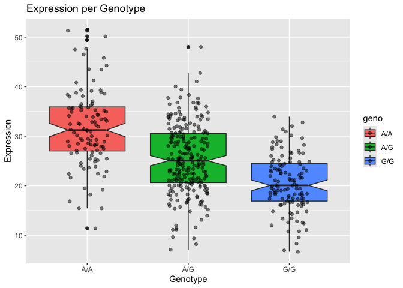

# Class 12: Genome Informatics
Zoe Matsunaga (PID: A16853288)
2025-05-12

# Section 1. Proportion of G/G in a population

Downloaded a CSV File from Ensemble \<
https://useast.ensembl.org/Homo_sapiens/Variation/Sample?db=core;r=17:39894595-39895595;v=rs8067378;vdb=variation;vf=959672880;sample=MXL#373531_tablePanel
\<

Here we read the CSV file we obtained:

``` r
mxl <- read.csv("373531-SampleGenotypes-Homo_sapiens_Variation_Sample_rs8067378.csv")
head(mxl)
```

      Sample..Male.Female.Unknown. Genotype..forward.strand. Population.s. Father
    1                  NA19648 (F)                       A|A ALL, AMR, MXL      -
    2                  NA19649 (M)                       G|G ALL, AMR, MXL      -
    3                  NA19651 (F)                       A|A ALL, AMR, MXL      -
    4                  NA19652 (M)                       G|G ALL, AMR, MXL      -
    5                  NA19654 (F)                       G|G ALL, AMR, MXL      -
    6                  NA19655 (M)                       A|G ALL, AMR, MXL      -
      Mother
    1      -
    2      -
    3      -
    4      -
    5      -
    6      -

``` r
table(mxl$Genotype..forward.strand.)
```


    A|A A|G G|A G|G 
     22  21  12   9 

``` r
table(mxl$Genotype..forward.strand.) / nrow(mxl) * 100
```


        A|A     A|G     G|A     G|G 
    34.3750 32.8125 18.7500 14.0625 

Now let’s look at a different population, GBR, “great Britian.”

``` r
gbr <- read.csv("373522-SampleGenotypes-Homo_sapiens_Variation_Sample_rs8067378.csv")
```

Find portion of GIG

``` r
round(table(gbr$Genotype..forward.strand.) / nrow(gbr) *100,2)
```


      A|A   A|G   G|A   G|G 
    25.27 18.68 26.37 29.67 

This varient associated with childhood asthma is more prevelant in the
GBR population than the MXL population.

Let’s dig deeper into this!

# Section 4: Population Scale Analysis

One sample is obviously not enough to know what is happening in a
population. You are interested in assessing genetic differences on a
population scale.

> Q13. How many samples do we have? What is their median expression
> levels for each of these geneotypes?

``` r
expr <- read.table("rs8067378_ENSG00000172057.6.txt")
head(expr)
```

       sample geno      exp
    1 HG00367  A/G 28.96038
    2 NA20768  A/G 20.24449
    3 HG00361  A/A 31.32628
    4 HG00135  A/A 34.11169
    5 NA18870  G/G 18.25141
    6 NA11993  A/A 32.89721

``` r
nrow(expr)
```

    [1] 462

Sample size per genotype:

``` r
table(expr$geno)
```


    A/A A/G G/G 
    108 233 121 

Median Expression Levels for each genotype:

``` r
library(dplyr)
```


    Attaching package: 'dplyr'

    The following objects are masked from 'package:stats':

        filter, lag

    The following objects are masked from 'package:base':

        intersect, setdiff, setequal, union

``` r
summary_expr <- expr %>%
  group_by(geno) %>%
  summarise(
    median_expression = median(exp, na.rm=TRUE)
  )

print(summary_expr)
```

    # A tibble: 3 × 2
      geno  median_expression
      <chr>             <dbl>
    1 A/A                31.2
    2 A/G                25.1
    3 G/G                20.1

> Q14. Generate a boxplot with a box per genotype.

``` r
library(ggplot2)

ggplot(expr) + aes(geno, exp, fill=geno) + 
  geom_boxplot(notch=TRUE) +
  geom_jitter(alpha=0.5, width=0.2) + 
  labs(title="Expression per Genotype",x="Genotype", y="Expression")
```



> Q14 continued. What could you infer from the relative expression value
> between A/A and G/G displayed in this plot? Does the SNP effect the
> expression of ORMDL3?

A\|A has a higher median expression than G\|G displayed in the plot.
Yes, the SNP does effect the expression of ORMDL3, with the A allese
suggesting higher association with ORMDL3.
