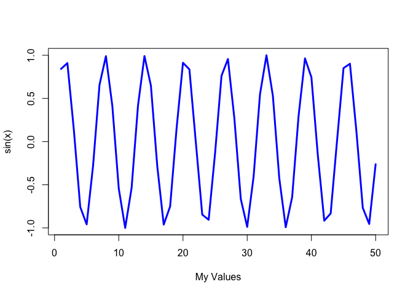

# Class 4: Intro to R
Zoe Matsunaga (PID: A16853288)

Let’s make a plot in R:

``` r
x<-1:50

plot(x,sin(x))
```


Let’s make a sin plot:

``` r
plot(x, sin(x), typ="l", col="blue", lwd=3, xlab="My Values")
```


